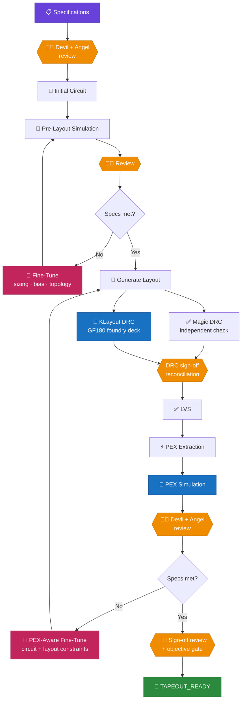

<div align="center">

# ⚡ MICROELECTRONIC BLOCK GENERATOR

### *From IDEA to SPICE, from SPICE to GDS — in an instant.*

**An autonomous analog layout engine.**
Describe a circuit in plain language; get back a routed, DRC-clean,
LVS-matched GDSII you can tape out.

<br/>

[](LICENSE)
[](https://github.com/google/gf180mcu-pdk)
[](pyproject.toml)
[](https://github.com/sscs-ose/sscs-chipathon-2026)


</div>

---

> **SSCS Chipathon 2026 — gLayout Track (D): AI/LLM for Analog Circuits**

An AI-assisted analog-layout framework that converts SPICE subcircuit netlists
into DRC-clean GDSII using [gLayout](https://github.com/ReaLLMASIC/gLayout),
[gdsfactory](https://github.com/gdsfactory/gdsfactory) and the **DeepSeek API**.
It closes the loop: ngspice drives the netlist, the layout engine realises it,
and Magic/netgen verify it — with every stage reporting honestly, so a failed
route is reported as a failure rather than quietly emitted as geometry.

| | |
| :--- | :--- |
| 🧠 **Agentic** | An LLM writes and tunes the netlist against real ngspice measurements |
| 📐 **Analog-aware** | Matching groups, symmetry constraints, per-device deep n-well isolation |
| 🧭 **DRC-aware routing** | A\* grid maze router with negotiated rip-up and via legality checks |
| 🔍 **Self-verifying** | Union-find connectivity check catches opens/shorts *before* signoff |
| 🧱 **Native passives** | Real `ppolyf_u` resistors and metal4/metal5 MIM caps, built from PDK layers |
| 🥇 **Dual-engine DRC** | KLayout runs the GF180 foundry deck as sign-off; Magic checks independently |
| 🔁 **PEX-aware search** | Two optimisation loops; candidates measured, compared, promoted or rolled back |
| 🧑‍⚖️ **Multi-agent review** | Independent Devil/Angel critics — they can block, never approve past a failed gate |
| 📦 **Tapeout-ready** | Emits GDS · LEF · LIB · Verilog · SPICE · PEX · SVG for LibreLane |

---

## 📋 Team Information

| | | |
| :--- | :--- | :--- |
| **Track** | D — gLayout | |
| **Team Name** | D08 Microelectronic Block Generator | |
| **Leader** | M. Taufiqul Huda | [@mthudaa](https://github.com/mthudaa) |

### Team Members

| Name | GitHub | Affiliation | Role |
| :--- | :--- | :--- | :--- |
| **M. Taufiqul Huda** | [@mthudaa](https://github.com/mthudaa) | NTUST | Lead Analog / Mixed-Signal Designer |
| **Ahmad Jabar Ilmi** | [@ilmiahmad](https://github.com/ilmiahmad) | LG Indonesia | Physical Verification & Automation |
| **Moh. Jabir Mubarok** | [@jabirmbrok](https://github.com/jabirmbrok) | NTUST | AI/LLM Integration & Software Architect |

---

## 🚀 Project Overview

We are developing a framework to automate the design of Analog IC blocks using
**gLayout**, **gdsfactory**, and the **DeepSeek API**.

Our framework leverages the **DeepSeek API** as an autonomous Analog Design
Engineer. Using a **SPICE-in-the-loop Finetuning** mechanism, the DeepSeek
model receives direct quantitative feedback from ngspice — including gain,
bandwidth, phase margin, delay, offset voltage, and PVT corner results — and
iteratively refines the SPICE netlist until all specifications are met. Once
verified, our custom engine automatically translates the netlist into a fully
routed, DRC-clean GDS layout.

### Key Milestones

- **Autonomous Optimization:** The DeepSeek agent has successfully generated
  and autonomously tuned a **StrongARM Latch Comparator** achieving `<10mV`
  input offset across all PVT corners.
- **Layout-Aware PEX Feedback:** The agent receives exact post-layout metrics
  from Magic PEX to close the gap between schematic simulation and actual
  silicon performance.
- **Test Key Circuits:** Comparator, OTA, and Voltage Reference.

> 📂 **See detailed AI design results:** [`AI-Generated-Design-Result/`](AI-Generated-Design-Result/README.md)
> — complete SPICE netlists, GDS layouts, DRC/LVS/PEX reports, and simulation
> plots for all three designs.

---

## 🔧 Technology Stack

| Component | Tool / Library |
| :--- | :--- |
| **PDK** | GF180MCU (`gf180mcuD`) — 3.3V, 180nm |
| **Schematic** | Xschem + Ngspice |
| **Layout** | gLayout + gdsfactory |
| **Physical Verification** | KLayout (DRC sign-off) + Magic (DRC, PEX), Netgen (LVS) |
| **AI/LLM** | DeepSeek API |
| **Install** | one `./install.sh` — no Docker, no root |
| **Languages** | Python 3, SPICE, Tcl, Bash |

---

## 🆕 What Changed in v0.2

Every claim below is backed by something you can re-run. The sections that
follow carry the detail and the exact command.

### Sign-off

| Change | Why it matters |
| :--- | :--- |
| **KLayout is now the DRC sign-off authority**, running the GF180 foundry deck alongside Magic | Magic's rules are an approximation of the foundry's. Running only Magic passed layouts the foundry deck rejects. Both engines must agree — see *"Dual-engine DRC — KLayout sign-off, Magic complementary"* |
| **`DRC_DISAGREEMENT` is a distinct verdict** | A Magic failure the foundry deck calls clean is not silently a pass, and not silently a fail — it is surfaced |
| **Missing KLayout reports `CONFIGURATION_FAILURE`, never PASS** | A missing checker used to look exactly like a clean run |

### Correctness fixes found by the new sign-off

| Fix | Symptom it removed |
| :--- | :--- |
| **GDS database unit 1e-9** (was 5e-9) | Every emitted GDS violated the GF180 DBU rule. Caught by KLayout, not by Magic |
| **DNW devices get a substrate tap ring outside the deep n-well** | `DN.3` violations on the body-biased OTA; the PPLUS tie sat inside the DNWELL |
| **Native passive rules corrected** — `PRES.6` 0.28 µm, `V4.1` 0.26 µm, `MIMTM.9` 0.50 µm | Wrong enclosure and via geometry on resistors and MIM capacitors |

### Flow

- **`/mbg-full-auto`** — one command from a written specification to a
  signed-off layout. It replaces `mbg-full-automate`, which was documented as a
  command but was never actually invocable.
- **Two-loop PEX-aware flow** — a pre-layout loop and a second loop that closes
  on *extracted* parasitics, so the number you sign off on is the post-layout one.
- **Multi-agent review** — Designer proposes; **Devil** attacks the result and
  **Angel** defends it independently; a Synthesizer rules on the evidence.
- **Branch-and-compare search** with rollback, a design memory, sensitivity
  analysis and a Pareto archive, replacing single-path refinement.

### Every module emits nine views

`GDS · LEF · LIB · schematic SPICE · PEX SPICE · Verilog · SVG · DRC report · LVS report`

`scripts/integrate_modules.py` consumes the LEF/LIB pair directly, so a block
drops into a **LibreLane** chip-level flow without a hand-written wrapper.

### Installation

| Change | Detail |
| :--- | :--- |
| **Five install scripts merged into one `./install.sh`** | Six stages — `python pdk eda shell agents global` — one argument parser, one set of helpers |
| **Global install** | `/mbg-*` slash commands work in any directory, for the whole user account, not only inside this checkout |
| **Shell integration** | One idempotent block in `~/.bashrc`; EDA tools pinned by **absolute path**, so DRC sign-off survives a `PATH` that has no `klayout` on it |
| **`mbg` / `mbg-python` launchers** | MBG's interpreter without activating a venv in every unrelated shell |
| **Nothing needs root or Docker** | `--deps --yes` is the only path that asks for `sudo`, and only for OS packages |

Licensed under **Apache 2.0**.

---

## ⚡ Design Flow

MBG has **two optimization loops**, not one.



Every stage is reviewed by two **independent** critics before the flow moves
on. They advise; the tools decide.

> **Loop A** — pre-layout optimization — finds a nominal circuit solution.
> **Loop B** — PEX-aware optimization — closes the loop on layout parasitics
> and produces the final sign-off candidate.

**PEX is feedback, not a final verification stamp.** A post-layout
specification miss starts an optimization iteration; it does not end the run.
Pre-layout PASS is not a finished design.

Three separations are load-bearing:

| | |
| :--- | :--- |
| **PEX extraction ≠ PEX simulation** | Extraction can succeed while the design misses every target. They report separately. |
| **Tool failure ≠ spec failure** | ngspice crashing does not mean the gain is too low. The optimizer must not tune in response to a broken tool. |
| **Verification gates extraction** | DRC or LVS failing ⇒ PEX and PEX simulation are `SKIP`, never run on a layout known to be wrong. |

### Why this matters — measured, not asserted

The regression inverter, biased at its own trip point, is a real small-signal
amplifier. Extraction costs it most of its bandwidth:

| Metric | Pre-layout | PEX | Δ |
| :--- | ---: | ---: | ---: |
| DC gain | 38.5 dB | 38.5 dB | ~0 |
| −3 dB bandwidth | **158.5 MHz** | **63.1 MHz** | **−60%** |

Gain is untouched and bandwidth collapses — the signature of capacitive
loading. A flow that stops at "PEX extraction completed" reports this design
as finished. `tests/test_pex_regression.py` reproduces these numbers.

### A real PEX-aware run

Actual output from the inverter above, with `bw_hz >= 100 MHz` — a target it
meets before layout and misses after. Every number here is measured, not
illustrative:

```text
[FLOW] Pre-layout iteration: 1/2
[SPECS]
  gain_db       38.52 dB       >= 30 dB  PASS
  bw_hz     1.585e+08 Hz  >= 1e+08 Hz    PASS
[FLOW] Pre-layout specifications satisfied.
[FLOW] Starting layout generation.

[VERIFY] DRC PASS      [VERIFY] LVS PASS      [PEX] Extraction PASS
[FLOW] Stage: PEX_SIMULATION
[SPECS]
  gain_db       38.52 dB       >= 30 dB  PASS
  bw_hz      6.31e+07 Hz  >= 1e+08 Hz    FAIL      <-- parasitics

[PEX] Pre-layout vs post-layout:
  bw_hz: 1.585e+08 Hz -> 6.31e+07 Hz  delta -9.54e+07 Hz (-60.2%)  worse  [FAIL]
[OPTIMIZE] Entering PEX-aware fine-tuning iteration 2.
                                   ... layout regenerated, DRC/LVS/PEX re-run

[SPECS]
  gain_db       35.81 dB       >= 30 dB  PASS
  bw_hz     8.913e+07 Hz  >= 1e+08 Hz    FAIL
```

| Metric | Pre-layout | PEX iter 1 | PEX iter 2 | Target | |
| :--- | ---: | ---: | ---: | ---: | :--- |
| `gain_db` | 38.52 dB | 38.52 dB | 35.81 dB | ≥ 30 dB | PASS |
| `bw_hz` | 158.5 MHz | 63.1 MHz | **89.1 MHz** | ≥ 100 MHz | FAIL |

Widening the critical net recovered **41% of the lost bandwidth** (63.1 →
89.1 MHz). It still missed the target, so with `max_pex_iterations=2` the run
ended `NOT_CONVERGED / DESIGN_FAILURE` and reported iteration 2 as the best —
which is the honest outcome, not a failure of the flow. Raising the limit, or
supplying a better `tune_post`, is what closes the remaining gap.

Reproduce with `tests/test_pex_regression.py`.

### Running the flow

```python
from mbg import Spec, DesignPoint, FlowConfig, DesignFlow, make_hooks

specs = [Spec("gain_db", ">=", 30.0, " dB"),
         Spec("bw_hz",   ">=", 100e6, " Hz")]

hooks = make_hooks(cell="inverter", in_node="in", out_node="out",
                   supplies={"vdd": 3.3, "vss": 0.0},
                   spec_names=[s.name for s in specs])

res = DesignFlow(hooks, FlowConfig(specs=specs, outdir="outputs/inv")).run(
    DesignPoint(cell="inverter", netlist=netlist))

res.status              # PASS | FAIL | NOT_CONVERGED | ERROR
res.failure             # SPEC_FAILURE | TOOL_FAILURE | VERIFICATION_FAILURE | ...
res.degradation         # pre-layout vs PEX, worst metric first
res.best_pex_iteration  # the best design is never silently lost
print(res.summary())
```

Iteration history is written to `<outdir>/history.json`. Both loops are
bounded (`max_pre_iterations`, `max_pex_iterations`, plus a `patience` stop
when tuning stops helping), so a run always terminates.

Diagnostics name the stage and the iteration:

```text
[FLOW] Stage: PEX_SIMULATION
[FLOW] PEX iteration: 1/8

[SPECS]
  gain_db      38.52 dB       >= 30 dB  PASS
  bw_hz     6.31e+07 Hz  >= 1e+08 Hz    FAIL

[PEX] Pre-layout vs post-layout:
  bw_hz: 1.585e+08 Hz -> 6.31e+07 Hz  delta -9.54e+07 Hz (-60.2%)  worse  [FAIL]

[PEX] Post-layout specification target not met.
[OPTIMIZE] Entering PEX-aware fine-tuning iteration 2.
```

### What is automated, and what is not

Being precise about this, because "automatic analog optimization" claims a lot:

| | Status |
| :--- | :--- |
| Two-loop flow, stage sequencing, verification gating, stop conditions, history, best-design tracking | **framework-supported** — `mbg.flow`, fully implemented and tested |
| Spec evaluation and pre-layout vs PEX degradation analysis | **framework-supported** — `mbg.specs` |
| PEX simulation of the extracted netlist | **framework-supported** — `mbg.flow_runtime` |
| Choosing *what* to change when PEX misses spec | **agent-assisted** — the bundled `tune_pre`/`tune_post` are documented heuristics (scale widths, widen critical nets), not an analog optimizer. Supply your own via `FlowHooks`. |
| Layout-constraint feedback (critical-net width, matched routing) reaching the placer/router | **partial** — constraints are carried on `DesignPoint.layout` and passed through; not every constraint is consumed by the router yet |
| Automatic topology change | **not implemented** |

`DesignPoint` keeps `circuit` and `layout` parameters separate because
post-layout tuning is not only sizing — a parasitic problem caused by a long
coupled route is not fixable by resizing a transistor.

### Primary Pipeline API

```python
from mbg.pipeline import spice_to_gds_with_checks

r = spice_to_gds_with_checks(netlist)
r["all_pass"]     # True only if DRC, LVS *and* internal connectivity all pass
r["drc"], r["lvs"], r["pex"]
r["gds_path"], r["outdir"]
r["views"]        # GDS · LEF · LIB · Verilog · SCH SPICE · PEX SPICE · SVG
```

Every run emits a full set of downstream views, so a block drops straight into
a LibreLane macro flow:

```python
from mbg.analysis import Testbench          # op / dc / ac / tran / monte_carlo
from mbg.integrate import integrate         # multi-macro chip assembly
```

`spice_to_gds_with_checks` runs the **DesignContext** engine (analog-aware
placement, DRC-aware grid router, union-find connectivity verification). Pass
`legacy=True` to reproduce the original shape-router behaviour.

### Chip integration

```bash
python scripts/integrate_modules.py --librelane \
       --top mbg_top --search outputs/regression --outdir integration/
```

Discovers every block that published a `*.views.json`, assembles them into one
top cell and signs it off — emitting the integration **GDS · LEF · LIB · SCH
SPICE · PEX SPICE · Verilog · DRC · LVS**, plus `info.yaml` and one
`lvs_config_<cell>.json` per block in the [SSCS Chipathon
2026](https://github.com/sscs-ose/sscs-chipathon-2026/tree/main/resources)
submission format. Add `--run` to hand the generated config to LibreLane.

Two things it will tell you rather than hide:

- **Ground is global.** The macros share a p-substrate, so substrate-tied
  grounds really are one net and the top netlist says so. A pin declared as
  ground that *isn't* tied gets named in a warning — Magic splits it off as
  `vss_uq2`, which means that block's ground is floating.
- **Top-level LVS of disconnected macros is inconclusive**, and is reported as
  such rather than as a pass. With no PDN and no inter-block nets the blocks
  are symmetric islands and netgen cannot assign net classes uniquely. Each
  macro's own LVS is authoritative; run LibreLane for a chip-level verdict.

See [`tests/notebooks/`](tests/notebooks/) for the end-to-end notebooks
(`spice_to_gds.ipynb`, `llm_to_gds.ipynb`) and [`tests/`](tests/) for the
regression suites that exercise the full design flow.

---

## 🧩 Complex Subcircuit Support

The reference blocks MBG grew up on — an inverter, a ring oscillator, a 5T
OTA — are small and, more importantly, *regular*: each is built from one or
two distinct transistor sizes. A 12-MOS two-stage clocked comparator is
neither, and it found a real complexity boundary. What that boundary actually
was is worth stating plainly, because the obvious answers were wrong.

### Device count did not predict the failure

| Design | MOS | nets | max net degree | +rail taps | matched groups | distinct (W, L) |
| :--- | ---: | ---: | ---: | ---: | ---: | ---: |
| `rc_filter` | 0 | 3 | 2 | 5 | 0 | – |
| `inverter` | 2 | 4 | 2 | 6 | 0 | 2 |
| `ota_5t` | 5 | 8 | 4 | 8 | 1 | 2 |
| `ota_bb` | 5 | 9 | 4 | 8 | 2 | 1 |
| `ring_osc_3` | 6 | 5 | 6 | 10 | 0 | 2 |
| `vref_1v2` | 7 | 6 | 7 | 11 | 2 | 2 |
| `strongarm` | 11 | 10 | **12** | **16** | 2 | **1** |
| `cmp_2stage_clk` | 12 | 11 | **12** | **16** | 4 | **7** |

The 11-MOS StrongArm comparator has the *same* maximum net degree as the
12-MOS clocked comparator — 12 device terminals on `vdd`, 16 counting the
power-rail taps — and it passed throughout. Device count differs by one. What
separates them is the last column: every earlier design uses one or two
transistor geometries, and the clocked comparator uses seven. Heterogeneous
sizing produces heterogeneous tap rings and row heights, and it was that
floorplan in which some `body` terminals could find no legal via landing.

So **no scalar metric is a go/no-go predictor here**, and the regression is
built as coverage rather than as a threshold: reproduce the table with
`python tests/test_complexity_ladder.py`.

### What was fixed, and what generalises

| Root cause | Fix | Generalises to |
| :--- | :--- | :--- |
| A stranded terminal abandoned the **whole net** — so blast radius scaled with net degree, which scales with circuit size | `route_net()` returns a plan *and* a failure; reachable terminals stay routed, the net is not marked complete | Any high-degree net; both the via-landing and the congestion failure paths |
| The DRC predicate judged a **notch per polygon**, so a pin escape drawn on a device's own tap ring was rejected against pads that ring encloses | A same-net near-miss is legal only when the facing slot is covered by same-net metal the new shape merges with (exact rectangle cover) | Every device whose terminal sits on multi-polygon tap metal |
| One wire **width per net**, chosen before the layer was known | `_emit_segment` raises each segment to its own layer's minimum | GF180 top metal (MT.1 = 0.44 µm vs 0.28 µm); any non-uniform stack |
| The grid pitch multiplied the **widest layer's width by the widest multiplier** and added the largest spacing — a wire that exists on no layer | Per-layer pitch, from one function the router and the power rails both use | Any PDK whose layers do not share one rule |
| Notch filling looked only at **route segments**, so a route stopping short of its own net's rail via drop left a gap nothing could see | Segments are paired against their net's obstacle metal too, and no fill may overlap another net | Power rails, device tap metal, anything net-owned |
| `all_pass` read **Magic only**; a KLayout failure, or KLayout never running, still reported success | All four legs: Magic **and** the dual-engine sign-off verdict **and** LVS **and** internal connectivity | Every caller of the primary API |
| A port label fell back to an **arbitrary access point** when a net was unrouted — able to name a foreign node after a port and manufacture a false LVS match | Labelling is refused for a multi-terminal net with no routed geometry, and says so | Any design where routing does not complete |
| `missing_access` — a SPICE terminal that never got an access point — was computed, printed, and **left out of the gate** | Folded into `verification["clean"]` | Terminals dropped before routing ever sees them |

Also in the front end: `+` line continuations, `$` / `;` inline comments, and
PDK inference from device models when no `.lib` line is present — plus a
validation pass that refuses a transistor with no usable W/L, a truncated
instance line, or an unrecognised model, **by name**, before layout starts.

### Result

```text
12-MOS Two-Stage Clocked Comparator
  internal connectivity   CLEAN  (0 opens, 0 shorts, 0 missing access)
  Magic DRC               CLEAN
  KLayout DRC             CLEAN   (GF180 foundry deck)
  DRC sign-off            PASS
  LVS                     MATCH   (11 nets == 11 nets, 12 == 12 devices)
  PEX extraction          OK      (39 coupling capacitors)
```

No GDS was hand-edited, no rule deck weakened, no LVS rule relaxed, and the
reference SPICE is unchanged. All eight regression designs pass all four legs.

### Tested limits — and what is *not* claimed

- **Verified**: up to **12 MOS / 11 nets / max net degree 16**, on GF180MCU
  3.3 V, flat (single `.subckt`), 3 signal routing layers (met3–met5) over
  device metal on met1/met2, with differential-pair, current-mirror and
  matched-group constraints.
- **Not claimed**: hierarchical designs (nested `.subckt` are not flattened —
  the child's devices are not seen), `.param` expansion, case-insensitive net
  names, and anything above the tested device count. Larger blocks may well
  work; they have not been signed off here, and this table will say so when
  they are.

---

## 🤖 Fully Automated Design — `/mbg-full-auto`

One design request in; a tapeout-ready package or a diagnosed failure out.

```text
/mbg-full-auto "Design a 5T OTA in GF180 with VDD=3.3 V, gain >= 40 dB,
bandwidth >= 100 MHz, phase margin >= 60 deg, power <= 1 mW, CL = 1 pF.
Produce a tapeout-ready package and design report."
```

Identical command on **Claude Code, Codex and OpenCode** — one canonical
definition in `.ai/`, generated into each platform.

```python
from mbg import Spec, make_hooks
from mbg.full_auto import run_full_auto, FullAutoConfig

res = run_full_auto(request, make_hooks(...),
                    config=FullAutoConfig(outdir="outputs/ota_5t"))
res.status          # SUCCESS | NOT_CONVERGED | BLOCKED | TOOL_FAILURE | ...
res.tapeout_ready   # True only when every gate condition PASSed
res.report_path
```

### Dual-engine DRC — KLayout sign-off, Magic complementary

```text
             ┌→ Magic DRC    (techfile rules — independent check)
Layout / GDS ─┤
             └→ KLayout DRC  (GF180 foundry deck — sign-off authority)
                       │
                 reconciliation
                       │
                 LVS → PEX
```

MBG uses KLayout as the primary DRC sign-off engine for the GF180 rule deck
shipped with the PDK (`libs.tech/klayout/tech/drc/gf180mcu.drc`, ~600 checks),
and runs Magic as an independent complementary DRC check. Neither is
"better" in the abstract — they implement different rule sets, which is
exactly why running both is worth the time.

| Situation | Verdict |
| :--- | :--- |
| both CLEAN | `PASS` |
| KLayout FAIL | `FAIL` |
| Magic FAIL, KLayout CLEAN | `DRC_DISAGREEMENT` — investigate, **not** a pass |
| either ERROR | `ERROR` |
| KLayout or its deck missing | `CONFIGURATION_FAILURE` |
| engines saw different GDS hashes | `ERROR` |

Both engines run on the same GDS, verified by hash. Counts are never compared
between engines — only statuses — and each engine's rule breakdown is kept.

Two traps this design guards against:

- **The GF180 deck always exits 0**, even with violations (its `exit()` is
  commented out for LibreLane compatibility). The verdict comes from the
  `.lyrdb` database; a run that produced no database is `ERROR`, never
  "0 violations".
- **Scope.** Die-level density rules (`M1.4`: *"metal coverage over the entire
  die shall be >30%"*) cannot be met by a leaf cell — they are satisfied by
  fill during chip assembly. Cell sign-off runs `decks=all,-density,-dummy`;
  an assembled die runs `decks=all`. That is scope, not relaxation.

#### What it found

Adding KLayout immediately surfaced **real defects Magic never checked**:

| Rule | Requirement | MBG had | Where |
| :--- | :--- | :--- | :--- |
| `DBU` | database unit must be 0.001 µm | **0.005 µm** | every GDS written |
| `V4.1` ×200 | via4 cut = 0.26 µm | **0.28 µm** | MIM capacitor |
| `MIMTM.9` ×84 | via spacing ≥ 0.5 µm on MIM top plate | **0.36 µm** | MIM capacitor |
| `PRES.6` | salicide-block overlap ≥ 0.28 µm | **0.20 µm** | poly resistor |
| `DN.3` | DNWELL needs a PCOMP guard ring | absent | DNW devices |

All are fixed. The RC filter went from **288 violations to 0**, and enabling
the substrate guard ring on deep-n-well devices cleared `DN.3`, so the
regression is **8/8 on both engines**.

Artifacts land in `<design>/verification/`: `klayout_drc.log`,
`<cell>.klayout.lyrdb` (open with `klayout <gds> -m <lyrdb>` to see markers),
`magic_drc.log`, and `drc_summary.json`.

### Convergence-driven multi-agent design

`/mbg-full-auto` runs an evidence-driven **search**, not a couple of guesses.

**What was wrong.** The optimizer took one fixed step per iteration with a
two-iteration budget. On the regression inverter it went 63.1 → 89.1 MHz
against a 100 MHz target and reported `NOT_CONVERGED`. A measured sweep found
the passing design one step further on. The direction was right; the step
policy and the budget were wrong. Worse, the "widen the critical net" advice
the reviewers produced was written onto the design and **never read by
anything** — every layout recommendation was inert, so the ledger credited
improvements to actions that did nothing.

**Branch-and-compare.** Each iteration proposes several *distinct* candidates
from one baseline, measures each independently, and promotes the winner:

```text
[SEARCH] evaluating 2 candidate(s) against baseline score 0.369
[SEARCH]   H1.1: score 0.1087   (scale device widths x0.9)
[SEARCH]   H1.2: score 0  PASSES ALL SPECS   (scale device widths x0.8)
[SEARCH] promoting H1.2 (score 0.369 -> 0)
```

Because each candidate is built and simulated on its own, in its own
directory, an improvement is attributable to exactly one change. The losers
are archived, not folded in.

| Mechanism | What it does |
| :--- | :--- |
| `sensitivity` | sizes the next step from a measured d(metric)/d(knob) |
| `line_search` | continues a direction that worked, and brackets it |
| `heuristic` | supplies the first move |
| wide bracket | fires only when no local move remains |
| memory | withholds a move that failed twice without ever helping |
| rollback | resumes from the best design when an iteration regresses |
| Pareto archive | keeps non-dominated alternatives for trade-off decisions |

**Never extrapolate.** The same sweep shows shrinking *further* reaches
224 MHz but drops gain to 26.2 dB — breaking the gain constraint — and that
the space is non-monotonic. Scoring is total normalised violation across
**all** required specs, so trading one violation for another scores worse.

**Effort.** `FullAutoConfig.for_effort("normal" | "high" | "exhaustive")` —
12/12/3, 20/20/4, 30/30/5 (pre iters / PEX iters / candidates). Default
prioritises convergence over wall-clock.

**Result on the 100 MHz challenge** — target unchanged, real Magic/netgen/ngspice:

| | Old | New |
| :--- | :--- | :--- |
| PEX bandwidth | 89.1 MHz | **125.9 MHz** |
| PEX gain | 35.81 dB | 31.81 dB |
| Status | `NOT_CONVERGED` | **`SUCCESS` — TAPEOUT_READY** |

### MBG command namespace

**Every MBG slash command begins with `/mbg-`.**

| Command | Purpose |
| :--- | :--- |
| `/mbg-full-auto` | **canonical** — full automation, request to sign-off |
| `/mbg-partial-automate` | the same flow, confirming each stage |
| `/mbg-review` | Devil + Angel review of the current state |
| `/mbg-signoff` | run the tapeout-ready gate |
| `/mbg-report` · `/mbg-status` | design report · run state |
| `/mbg-check` · `/mbg-install` · `/mbg-setup-env` | environment |
| `/mbg-new-skill` · `/mbg-new-command` | authoring |
| `/mbg-review-ai-experiment` · `/mbg-review-extension` | audits |

Generic names (`/full-auto`, `/full-design`, `/review`, `/signoff`) are not
MBG commands and are rejected by `scripts/check_agent_workflows.py`.

### Multi-agent review

```text
              Designer  ── proposes and modifies (only role that edits)
                 │
      ┌──────────┴──────────┐
   Devil                  Angel
   tries to falsify it    finds the cheapest change likely to work
      └──────────┬──────────┘
            Synthesizer  ── weighs both against measured evidence
                 │
   ACCEPT · REVISE · RETRY · ROLLBACK · ESCALATE · BLOCK
```

Reviewers return structured findings and recommendations; they never edit the
design. Precedence is fixed and not negotiable:

1. a reviewer that failed to run ⇒ `ESCALATE` — **silence is not approval**;
2. a hard gate (DRC/LVS/PEX) failure outranks everything;
3. an unresolved `CRITICAL` finding blocks acceptance;
4. measured evidence outranks reviewer sentiment;
5. reviewer verdicts last.

**Critics can block. They cannot approve past a failed gate.** Two optimistic
reviewers never turn an LVS mismatch into a sign-off.

The bundled critics are deterministic and rule-based, so the flow still runs
with no AI platform available. A platform registers a richer LLM critic with
`mbg.reviewers.register_reviewer(...)` without changing any control logic.

Every recommendation is traced `PROPOSED → APPLIED → IMPROVED | NEUTRAL |
DEGRADED` with the measured score before and after, so advice that never helps
is withheld after two attempts.

### What "tapeout ready" means

`SUCCESS` requires **every** configured condition to be `PASS`:

```text
pre-layout specs   PEX specs        DRC clean       LVS match
PEX extraction     final GDS        final PEX netlist
no CRITICAL findings                reviews complete    design report
PVT corners             only if configured
Monte Carlo / mismatch  only if configured
```

A condition that was not evaluated reads **`NOT RUN`** and **fails** the gate.
It is never counted as a pass, and no claim is made about an analysis that did
not run.

### Outputs

```text
outputs/<design>/
    history.json             per-iteration flow record
    review_history.json      decisions, findings, recommendation trace
    full_auto_result.json    machine-readable result
    final_design_report.md   design report, or non-convergence report
    final/                   GDS · PEX netlist · DRC/LVS reports · history
```

On non-convergence you get a **failure report**, not silence: best iteration,
which specs remain unmet and by how much, unresolved findings, what was tried,
what helped, what did not, and the recommended manual intervention.

### Honest scope

`/mbg-full-auto` means *autonomous execution of the supported design,
verification and optimization loop*. It does **not** mean guaranteed analog
design success from arbitrary specifications.

| | Status |
| :--- | :--- |
| Orchestration, stage sequencing, bounds, gates, packaging, reporting | **implemented** |
| Devil/Angel review, synthesis, severity, ledger, review history | **implemented** |
| Spec parsing with `given`/`inferred`/`defaulted`/`missing` provenance | **implemented** |
| Candidate search: branching, measured selection, credit assignment, rollback, memory, sensitivity | **implemented** — `mbg.search` |
| Deciding *what* to change on a spec miss | **heuristic + measured search** — the candidate generator proposes device-width moves and sizes them from measured sensitivity. It does not yet propose topology changes or per-net layout edits; supply your own strategy or `tune_post`, or let an agent decide. |
| Layout-constraint feedback reaching the router | **partial** — `DesignPoint.layout` is now forwarded into a real `RouterConfig` (global `width_multiplier`, `access_layer`, `routing_layers`). Per-net width and spacing are **not** available: the router's `width_for()` distinguishes only power from signal. |
| Per-net parasitic ranking from the extracted netlist | **implemented** — `mbg.flow_runtime.net_capacitance` |
| Artifact provenance (GDS ↔ PEX ↔ simulation hashes, per-iteration dirs) | **implemented** |
| PVT corners, Monte Carlo in the gate | **configurable, not run by default** |
| Automatic topology selection | **not implemented** |

Outcomes are `TAPEOUT_READY` or a diagnosed failure state. Nothing else.

---

## 🛠️ Getting Started

**Local install, no Docker, no root.** Everything lands in three places you
control: `.venv/` inside the clone, `$MBG_TOOLS_ROOT` (default
`~/.local/mbg-tools`) for EDA builds, and `$MBG_HOME` (default `~/.mbg`) for
activation and launchers. Nothing is written to `/usr`, `/usr/local`, or the
system package database unless you explicitly ask for OS build dependencies.

### Prerequisites

| | |
| :--- | :--- |
| **OS** | Linux — Debian/Ubuntu, Fedora/RHEL-like, Arch-like, openSUSE are detected |
| **Python** | 3.10 – 3.12 (`MBG_PYTHON=/path/to/python3.11` to pin one) |
| **Git** | any recent version |
| **Disk** | ~2 GB (the GF180 PDK is most of it) |

Building Magic or netgen needs a C toolchain, Tcl/Tk, Cairo and X11 headers.
You only need these if you don't already have compatible tools:

```bash
./install.sh --deps        # prints the exact packages for your distro
./install.sh --deps --yes  # installs them (prompts for sudo)
```

Installing OS packages is the one step that needs root, so it is never done
silently.

### Quick Start

```bash
git clone https://github.com/mthudaa/Microelectronic-Block-Generator.git
cd Microelectronic-Block-Generator

./install.sh          # all six stages: python, pdk, eda, shell, agents, global
source scripts/activate_mbg.sh  # venv + PDK vars + tool PATH, in one step

./install.sh --check  # preflight; non-zero if anything required fails
python tests/test_all_designs.py
```

`install.sh` reuses whatever already works. If you have a compatible Magic,
netgen and PDK, it detects them and builds nothing.

<details>
<summary><b>Step by step, on a blank machine</b></summary>

If nothing is installed yet, run the stages individually so a failure tells
you exactly which one it was:

```bash
# 0. OS build packages — the only step that needs root.
#    Skip it if you already have working Magic and netgen.
./install.sh --deps          # review the list first
./install.sh --deps --yes    # then install

# 1. Python: .venv, pinned dependencies, `pip install -e .`
./install.sh --stage python

# 2. GF180MCU PDK via volare (~1.5 GB download)
./install.sh --stage pdk

# 3. Magic, netgen and KLayout — builds only what is missing or incompatible
./install.sh --stage eda

# 4. Activate, then confirm
source scripts/activate_mbg.sh
./install.sh --check
```

Each stage is idempotent: re-running one that already succeeded does nothing.

</details>

### Installation modes

One script, six stages. Run it whole, or one stage at a time.

| Command | What it does |
| :--- | :--- |
| `./install.sh` | every stage below, in dependency order |
| `./install.sh --list` | show the stages and stop |
| `./install.sh --stage python` | `.venv`, pinned dependencies, `pip install -e .` |
| `./install.sh --stage pdk` | GF180MCU via volare into `$PDK_ROOT` |
| `./install.sh --stage eda` | Magic, netgen and **KLayout** into `$MBG_TOOLS_ROOT` — only what is missing or incompatible |
| `./install.sh --stage shell` | `~/.mbg/activate.sh`, the `mbg` launchers, one `~/.bashrc` line |
| `./install.sh --stage agents` | repo-scoped `/mbg-*` adapters + the Codex plugin *(optional)* |
| `./install.sh --stage global` | `/mbg-*` for the whole user account *(optional)* |
| `./install.sh --deps` | print (or with `--yes`, install) OS build packages |
| `./install.sh --check` | full preflight, installs nothing; non-zero only on a real failure |
| `./install.sh --uninstall` | remove shell + agent integration; keeps venv, PDK and built tools |

`--check` and `--uninstall` accept `--stage` too, so you can inspect or undo a
single layer. `agents` and `global` are optional: if one does not complete the
install still succeeds, because MBG itself works without the agent layer.

### Tool versions

| Tool | Requirement | Tested |
| :--- | :--- | :--- |
| Python | 3.10 – 3.12 | 3.10.20, 3.11.15 |
| Magic | **≥ the version the techfile names** (`requires magic-8.3.411`) | 8.3.669, 8.3.681 |
| netgen | ≥ 1.5.200, must terminate in `-batch` | 1.5.322, 1.5.323 |
| **KLayout** | **required for DRC sign-off** — ≥ 0.30.9 (the GF180 deck warns that parallel runs below this hit KLayout issue #2339) | 0.30.9 |
| PDK | `gf180mcuD` via volare, incl. `libs.tech/klayout/tech/drc/gf180mcu.drc` | — |
| ngspice | optional — simulation only | 45 |

KLayout is no longer optional: without it there is no foundry-deck DRC, and
the sign-off gate reports `CONFIGURATION_FAILURE` rather than passing on
Magic alone. Point MBG at a binary with `MBG_KLAYOUT=/path/to/klayout` if it
is not on `PATH` — note the **`klayout` pip package is not sufficient**: it
ships no executable and cannot run the deck's Ruby DSL.

The Magic floor is read from *your* installed techfile rather than hard-coded,
so the check tracks the PDK you actually have. An exact-version pin would
reject working installations for no reason.

### Environment variables

`source scripts/activate_mbg.sh` sets all of these — and once the `shell`
stage has run, every new shell has them already. You shouldn't need to export
them by hand. Any value you set first is respected.

| Variable | Default | Purpose |
| :--- | :--- | :--- |
| `PDK_ROOT` | `$HOME/.volare` | where PDKs live |
| `PDK` | `gf180mcuD` | active PDK |
| `PDKPATH` | `$PDK_ROOT/$PDK` | active PDK root |
| `STD_CELL_LIBRARY` | `gf180mcu_fd_sc_mcu7t5v0` | standard cells |
| `MBG_TOOLS_ROOT` | `$HOME/.local/mbg-tools` | where MBG builds EDA tools |
| `MBG_HOME` | `$HOME/.mbg` | activation script and the `mbg` launchers |
| `MBG_ROOT` | the clone | repository root |
| `MBG_VENV` | `<repo>/.venv` | MBG's Python environment |
| `MBG_MAGIC` / `MBG_NETGEN` | — | pin an exact executable |
| `MBG_KLAYOUT` / `MBG_NGSPICE` | — | pin an exact executable |
| `MBG_MAGIC_ROOT` / `MBG_NETGEN_ROOT` / `MBG_KLAYOUT_ROOT` | — | pin a prefix (`<prefix>/bin/<tool>`) |
| `MBG_TOOL_TIMEOUT` | per tool | seconds before an EDA call is killed |
| `MBG_MAGIC_TIMEOUT` / `MBG_NETGEN_TIMEOUT` | 900 | per-tool override |

`PDK_ROOT` has to exist **before** anything imports gLayout, which reads it at
import time. `import mbg` sets it for you, so this is handled even if you
forget — but a wrong value is still your value.

### Which binaries am I actually running?

Every run prints what it resolved, because "there is a `magic` on PATH" and
"Magic can drive this PDK" are different claims:

```text
[TOOLS] magic: /home/user/.local/mbg-tools/magic-8.3.681/bin/magic (8.3.681, via MBG_TOOLS_ROOT)
[TOOLS] netgen: /home/user/.local/mbg-tools/netgen-1.5.323/bin/netgen (1.5.323, via MBG_TOOLS_ROOT)
[TOOLS] klayout: /home/user/.local/mbg-tools/klayout-0.30.9/bin/klayout (0.30.9, via $MBG_KLAYOUT)
```

Resolution order, per tool: `MBG_<TOOL>` → `MBG_<TOOL>_ROOT` → `$MBG_TOOLS_ROOT`
→ `PATH`. A tool is accepted only after a version check *and* a functional
probe. If you name one explicitly and it doesn't work, that's an error — MBG
will not quietly run a different one instead.

KLayout is the case this matters most for. Several distributions ship no
`klayout` package at all, so the working binary often lives somewhere `PATH`
never looks; the `shell` stage pins it by absolute path for exactly that
reason.

### Verify the install

`--check` is the single source of truth — it asks the same resolver the
pipeline uses, so it cannot pass while a real run picks a different binary.

```bash
./install.sh --check
```

```text
MBG Local Environment Check
==================================================

Operating System
  distro                 PASS  Fedora Linux 43 (Workstation Edition)

Python
  virtualenv             PASS  /path/to/repo/.venv
  python                 PASS  3.11.15
  mbg                    PASS  0.2.0
  gdsfactory             PASS  7.7.0
  gdstk                  PASS  0.9.62
  glayout                PASS  0.1.2
  numpy                  PASS  1.24.0

PDK
  PDK                   PASS  gf180mcuD
  PDK_ROOT              PASS  /home/user/.volare
  PDKPATH               PASS  /home/user/.volare/gf180mcuD
  standard cells        PASS  gf180mcu_fd_sc_mcu7t5v0
  Magic techfile        PASS  requires magic-8.3.411
  Netgen setup          PASS  

EDA
  Magic executable      PASS  /usr/local/bin/magic
  Magic version         PASS  8.3.669
  Netgen executable     PASS  /usr/local/bin/netgen
  Netgen version        PASS  1.5.322
  KLayout executable    PASS  /nix/store/<hash>-klayout-0.30.9/bin/klayout
  KLayout version       PASS  0.30.9
  KLayout GF180 deck    PASS  /home/user/.volare/gf180mcuD/libs.tech/klayout/tech/drc/gf180mcu.drc
  ngspice               PASS  /usr/local/bin/ngspice

Regression readiness
  GDS generation        READY  
  Magic DRC             READY  independent complementary check
  KLayout DRC           READY  primary sign-off (GF180 foundry deck)
  DRC sign-off          READY  both engines required
  Magic extraction      READY  
  Netgen LVS            READY  

Environment OK — the GF180 regression can run.
```

Exit status is **0** only when every *required* component passes. Optional
components (KLayout, ngspice) are reported but never fail the check.

Then run the real thing:

```bash
python -m pytest tests/ -q                    # 209 tests                    (~5 min)
python tests/test_all_designs.py              # 8 designs, all four legs     (~5 min)
python tests/test_complexity_ladder.py        # complexity metrics           (instant)
```

The design regression drives real gLayout, Magic, KLayout and netgen, so it is
opt-in under pytest rather than part of every run:

```bash
MBG_RUN_DESIGNS=1 python -m pytest tests/test_all_designs.py -q
MBG_LADDER=full   python tests/test_complexity_ladder.py     # ladder + DRC/LVS
```

```text
  design                               Magic   KLayout   sign-off  LVS     internal
  Inverter                             CLEAN   CLEAN     PASS      MATCH   CLEAN
  3-stage Ring Oscillator              CLEAN   CLEAN     PASS      MATCH   CLEAN
  5T-OTA                               CLEAN   CLEAN     PASS      MATCH   CLEAN
  DNW Body-Biased OTA                  CLEAN   CLEAN     PASS      MATCH   CLEAN
  VREF Beta-Multiplier                 CLEAN   CLEAN     PASS      MATCH   CLEAN
  RC Filter (native passives)          CLEAN   CLEAN     PASS      MATCH   CLEAN
  StrongArm-Comparator                 CLEAN   CLEAN     PASS      MATCH   CLEAN
  2-Stage Clocked Comparator (12 MOS)  CLEAN   CLEAN     PASS      MATCH   CLEAN

  8/8 designs pass all four legs (Magic + KLayout + LVS + internal)
```

"All four legs" is the same gate `spice_to_gds_with_checks()` uses for
`all_pass`, so the harness and the library cannot disagree about what passing
means. Magic-clean alone is not a pass, and neither is a DRC result with the
internal connectivity check left out.

### What gets installed, and how to undo it

| Location | Contents | Remove with |
| :--- | :--- | :--- |
| `<repo>/.venv/` | Python environment | `rm -rf .venv` |
| `$PDK_ROOT` (`~/.volare`) | GF180MCU PDK | `rm -rf ~/.volare/gf180mcuD` |
| `$MBG_TOOLS_ROOT` (`~/.local/mbg-tools`) | Magic / netgen builds + sources | `rm -rf ~/.local/mbg-tools` |

Nothing else is touched. `/usr`, `/usr/local` and the system package database
are only ever written to by `--deps --yes`, which asks for sudo explicitly and
installs nothing else.

### Troubleshooting

<details>
<summary><b>PDK_ROOT missing / <code>TypeError: ... not NoneType</code></b></summary>

gLayout calls `Path(os.getenv("PDK_ROOT"))` at import time, so an unset
variable used to surface as a `TypeError` from inside gLayout. `import mbg`
now populates the PDK environment first. If the PDK itself is missing:

```bash
./install.sh --stage pdk
```
</details>

<details>
<summary><b>Magic incompatible</b></summary>

```text
Magic version 8.3.411 is required by this techfile, but this version of magic is 0.0.0
Nothing in "cifinput" section of tech file.
```

A Magic that predates the techfile reads no GDS and extracts nothing — and
still exits 0. It is rejected rather than used:

```bash
./install.sh --stage eda     # builds a known-good Magic locally
```
</details>

<details>
<summary><b>netgen incompatible or hanging</b></summary>

Some builds sit waiting on stdin under `-batch`; the mesh generator of the
same name isn't the LVS tool at all. Both are caught by the batch probe.

```bash
./install.sh --stage eda
```
</details>

<details>
<summary><b>Building Magic/netgen fails on a Tcl 9 system (Fedora 43+)</b></summary>

```text
couldn't load file ".../tclnetgen.so": cannot open shared object file
make[2]: *** No rule to make target '../base/libbase.o', needed by 'tclnetgen.so'
```

Magic and netgen build their Tcl extensions against the system Tcl and
support **8.6**. Distributions that have moved to **Tcl 9** (Fedora 43 and
newer) produce a launcher script with no working library behind it.

`--eda` detects this and **refuses to install the broken build** rather than
leaving you with a tool that exists and never works. Options, in order of
least effort:

1. **Use what you have.** MBG detects and reuses any working Magic/netgen —
   run `./install.sh --check` first; you may not need to build
   anything.
2. Install Tcl 8.6 development files and rebuild.
3. Use the optional Docker image, which ships working tools.

</details>

<details>
<summary><b>KLayout not found — DRC sign-off unavailable</b></summary>

```text
DRC sign-off (Magic + KLayout)   CONFIGURATION_FAILURE
```

KLayout is **required**: it runs the GF180 foundry rule deck and is the
sign-off authority. Without it the gate reports `CONFIGURATION_FAILURE`
rather than passing on Magic alone.

The **`klayout` pip package is not enough** — it ships no executable and
cannot run the deck's Ruby DSL. You need the standalone binary.

`./install.sh --stage eda` installs it where upstream publishes a build,
unpacking the official package **into `$MBG_TOOLS_ROOT` without sudo**:

| Distribution | Package used |
| :--- | :--- |
| Ubuntu 16/18/20/22/24/26, Debian | `klayout_0.30.10-1_amd64.deb` |
| Rocky / RHEL / AlmaLinux 9 | `RockyLinux_9` RPM |
| CentOS 7/8 | `CentOS_7` / `CentOS_8` RPM |
| openSUSE Leap 15 | `openSUSE_Leap_15` RPM |
| **Fedora, Arch** | **no upstream build** — see below |

**Fedora has no official KLayout package, and the EL9 build does not work
there.** Extracting the Rocky 9 RPM on Fedora 43 leaves it unable to start:

```text
libpython3.9.so.1.0 => not found      libruby.so.3.0 => not found
libhttp_parser.so.2 => not found      libQt5Multimedia.so.5 => not found
```

Ruby is the decisive one — the GF180 DRC deck *is* Ruby, so a KLayout without
it cannot run the deck at all. On Fedora, either build from
[source](https://www.klayout.org/downloads/source/) or point MBG at an
existing binary:

```bash
export MBG_KLAYOUT=/path/to/klayout
./install.sh --stage eda   # adopts it: stable path + nix GC root if applicable
```

Adoption gives you a stable `$MBG_TOOLS_ROOT/klayout-<version>/bin/klayout`
so nothing depends on remembering a store hash, and — for a nix-store binary
— registers a GC root so `nix-collect-garbage` cannot delete it out from
under you.

Version ≥ 0.30.9 — the GF180 deck warns that parallel runs below that hit
KLayout issue #2339.
</details>

<details>
<summary><b>KLayout reports violations Magic did not</b></summary>

Expected, and the reason both run. They implement different rule sets: Magic
checks its techfile rules, KLayout runs the ~600-check foundry deck. Counts
are never compared — only statuses.

Two common cases:

- **Die-level density rules** (`M1.4`, `PL.8`, `DCF.1b`) — *"metal coverage
  over the entire die shall be >30%"*. A leaf cell cannot satisfy these; they
  are met by fill during chip assembly. Cell sign-off runs
  `decks=all,-density,-dummy`; use `decks=all` for an assembled die.
- **Real defects Magic does not check** — e.g. `DBU`, `V4.1`, `MIMTM.9`,
  `PRES.6`, `DN.3`. These are genuine; fix them.

Open the markers to see exactly where:

```bash
klayout <design>.gds -m <design>/verification/<cell>.klayout.lyrdb
```
</details>

<details>
<summary><b>Extraction failure / LVS skipped</b></summary>

```text
[ERROR][MAGIC_EXTRACTION]
  ...
LVS was SKIPPED because no valid extracted SPICE netlist was generated.
Full log: outputs/regression/inverter/logs/magic_extract.log
```

This is correct behaviour. LVS depends on extraction; with no extracted
netlist there is nothing to compare. Fix the extraction — the log names the
cause. MBG will never substitute the `.gds` for the missing netlist.
</details>

<details>
<summary><b>Tool timeout</b></summary>

```text
netgen exceeded 900s during netgen_lvs and was terminated.
```

The process group is killed and the log kept. Raise the bound if the design
is genuinely that large:

```bash
export MBG_NETGEN_TIMEOUT=1800
```
</details>

<details>
<summary><b>Where are the logs?</b></summary>

Next to each result, never discarded:

```text
outputs/regression/<cell>/logs/
    magic_drc.log
    magic_extract.log
    netgen_lvs.log
```
</details>

### Docker (optional alternative)

Local installation is the supported path. The IIC-OSIC-TOOLS container
remains available if you'd rather not install EDA tools at all:

<details>
<summary>Container instructions</summary>

```bash
./start_chipathon_vnc.sh     # Linux/macOS
.\start_chipathon_vnc.bat    # Windows
```

| Method | Address | Password |
| :--- | :--- | :--- |
| VNC client | `localhost:5901` | `abc123` |
| Browser (noVNC) | `http://localhost` | `abc123` |

Inside the container:

```bash
unset PYTHONPATH PYTHONHOME LD_LIBRARY_PATH
source /headless/conda-env/miniconda3/etc/profile.d/conda.sh
conda activate GLdev
export PDK_ROOT=/foss/pdks PDK=gf180mcuD PDKPATH=/foss/pdks/gf180mcuD
export STD_CELL_LIBRARY=gf180mcu_fd_sc_mcu7t5v0
```

The container ships its own Magic and netgen, so `--eda` is unnecessary there.
</details>

---

## 🤖 AI Coding Agent Integrations

The project ships a **canonical agent layer** under `.ai/` that is the single
source of truth for every domain skill and workflow (SPICE→GDS, DRC/LVS/PEX,
placement/routing debug, design regression, experiment audit, extension
authoring). A sync script regenerates matching, platform-native adapters for
three coding agents — **OpenCode**, **Claude Code**, and **Codex** — so the
same `mbg-` skill behaves the same way no matter which agent you're driving.

All project-specific extensions use the `mbg-` prefix.

### ⚡ Quick install

```bash
git clone <this-repo> && cd Microelectronic-Block-Generator
./install.sh          # everything
```

Then open a new shell and check it:

```bash
mbg check
```

`install.sh` is the only command you need. It runs six stages in order, each
of which is a script under `scripts/` that also works standalone:

| Stage | Does | Required |
| :--- | :--- | :--- |
| `python` | `.venv` + pinned dependencies + `pip install -e .` | yes |
| `pdk` | GF180MCU via volare | yes |
| `eda` | Magic, netgen, KLayout — reused if already compatible | yes |
| `shell` | `~/.mbg/activate.sh` + one line in `~/.bashrc` | yes |
| `agents` | repo-scoped adapters + the Codex plugin | optional |
| `global` | `/mbg-*` skills for the whole user account | optional |

```bash
./install.sh --check          # verify every layer, install nothing
./install.sh --stage eda      # run one stage
./install.sh --list           # what each stage does
./install.sh --uninstall      # remove shell + agent integration
```

An optional stage that does not complete is reported but does not fail the
install — MBG itself still works without the agent integrations.

`--uninstall` deliberately leaves the venv, the PDK and the built tools
alone. Those take a long time to rebuild, so removing them stays a
deliberate manual act.

### Shell integration

The `shell` stage writes one generated file, `~/.mbg/activate.sh`, and adds
**one** line to `~/.bashrc` (and `~/.zshrc` if present):

```bash
# >>> Microelectronic Block Generator >>>
[ -f "$HOME/.mbg/activate.sh" ] && . "$HOME/.mbg/activate.sh"
# <<< Microelectronic Block Generator <<<
```

After that a fresh shell has, from any directory:

| Variable | Purpose |
| :--- | :--- |
| `MBG_HOME`, `MBG_ROOT`, `MBG_VENV` | install root, checkout, interpreter |
| `PDK_ROOT`, `PDK`, `PDKPATH`, `STD_CELL_LIBRARY` | GF180 |
| `MBG_MAGIC`, `MBG_NETGEN`, `MBG_KLAYOUT`, `MBG_NGSPICE` | **resolved absolute paths** |
| `MBG_TOOLS_ROOT`, `PATH` | MBG-built tools and launchers |

Tools are pinned by absolute path rather than left to `PATH` order. That
matters here: Fedora has no `klayout` package and the working binary lives in
a nix store outside `PATH`, so a `PATH`-only setup silently loses DRC
sign-off. Verified by running `mbg check` in a shell with `/usr/local/bin`
stripped — all four tools still resolve.

Every assignment defers to a value you already exported, so your own settings
win.

**The virtualenv is deliberately not activated.** Doing that in `.bashrc`
changes what `python` and `pip` mean in every shell, including ones opened
for unrelated projects. Instead `~/.mbg/bin` goes on `PATH` with launchers
that use MBG's interpreter explicitly:

```bash
mbg check          # environment preflight
mbg version
mbg python x.py    # run with MBG's interpreter
mbg-python -c ...
```

Pass `--with-venv` if you would rather have it active everywhere.

```bash
./install.sh --check --stage shell      # exactly one block? tools pinned?
./install.sh --uninstall --stage shell  # removes the line and ~/.mbg/activate.sh
```

Re-running is safe: the block is replaced, never appended. Verified over five
install/uninstall cycles — one block, and the original `.bashrc` lines
byte-identical.

Step 2 makes `/mbg-*` work when the agent is started **inside this checkout**;
Codex is registered per machine because it has no repo-scoped skills.

Step 3 installs for the **current user**, so `/mbg-full-auto` works from
anywhere:

| Platform | Installed to |
| :--- | :--- |
| Claude Code | `~/.claude/skills/mbg-*`, `~/.claude/commands/mbg-*.md` |
| OpenCode | `~/.config/opencode/skills/mbg-*`, `~/.config/opencode/commands/mbg-*.md` |
| Codex | plugin registered by the `agents` stage |

It uses **symlinks**, so a `sync_agent_tools.py` run reaches the global
install immediately — a copied skill silently goes stale and the slash
command ends up invoking last week's instructions. Use `--copy` if your setup
cannot follow symlinks, and re-run it after every sync.

Only `mbg-*` entries are created or removed; other projects' skills in those
directories are never touched.

```bash
./install.sh --check --stage global      # is the global install current?
./install.sh --uninstall --stage global  # remove only the mbg-* entries
```

That is the whole setup. Every stage is idempotent, discovers the repository
root itself, and performs no git operations. If you only want the agent
layer and already have a working environment, step 2 alone is enough.

Inside an agent you can run the same thing as a slash command:

```text
/mbg-install      # both steps, then verification
/mbg-setup-env    # Python environment only
```

Codex has no slash commands — ask for the skill by name instead:
*"use the mbg-setup skill to install this repository"*.

**As a Python package**

```bash
pip install -e ".[dev,notebooks]"   # editable, from a clone
pip install -r requirements-lock.txt # exact known-good versions
```

This installs the `mbg` package plus two console commands, `mbg-sync` and
`mbg-validate`.

```python
from mbg import spice_to_gds_with_checks
r = spice_to_gds_with_checks(netlist)
r["gds_path"], r["drc"], r["lvs"], r["pex"], r["all_pass"]
```

**Requirements.** Python 3.10–3.12 — gdsfactory 7 and numpy 1 have no wheels
for 3.13+, and `install.sh` picks a supported interpreter automatically. The
EDA tools (ngspice, Magic, netgen) and the GF180MCU PDK come from the
IIC-OSIC-TOOLS container; the setup script reports whether it can see them but
does not install them.

| | Per-machine step? | What the installer does |
| :--- | :--- | :--- |
| **Python** | yes | creates `.venv`, installs `mbg` editable |
| **OpenCode** | no — reads `.opencode/` from the clone | `npm install` for the custom `.ts` tools |
| **Claude Code** | no — reads `.claude/` from the clone | nothing to register |
| **Codex** | **yes** — no repo-scoped skills exist | registers the local plugin marketplace |

Useful variants:

```bash
./install.sh --check        # report status, install nothing
./install.sh --stage python       # exact pinned versions
./install.sh --stage python       # rewrite requirements-lock.txt
./install.sh --check --stage agents   # report status, change nothing
./install.sh --stage agents
./install.sh --uninstall --stage agents
```

### Canonical architecture: source vs. generated

```text
                         SOURCE OF TRUTH (hand-edited)
        .ai/manifest.json  +  .ai/skills/*/SKILL.md  +  .ai/workflows/*.md
                                        │
                                        │  python3 scripts/sync_agent_tools.py
                                        ▼
        ┌───────────────────────────────────────────────────────────────┐
        │                                                               │
        ▼                              ▼                                ▼
  .opencode/skills/**            .claude/skills/**              plugins/mbg-analog/skills/**
  .opencode/commands/**          .claude/commands/**             plugins/mbg-analog/.codex-plugin/plugin.json
        (OpenCode)               CLAUDE.md (@AGENTS.md import)   .agents/plugins/marketplace.json
                                        (Claude Code)                    (Codex)

                                        +  .ai/project-index.json  (repo map used by all three)

  AGENTS.md — shared rules — is NOT generated. OpenCode and Codex read it
  natively; CLAUDE.md imports it with a single `@AGENTS.md` line so Claude
  Code shares the exact same rules instead of a forked copy.
```

Every generated file opens with an HTML comment banner naming its source and
the regeneration command — if a file doesn't have that banner, it's
hand-maintained and safe to edit directly; if it does, edit the source under
`.ai/` instead and resync.

### Source of truth vs. generated vs. platform-specific

| Layer | Files | Rule |
| :--- | :--- | :--- |
| **Source of truth** (hand-edited) | `.ai/manifest.json`, `.ai/skills/<name>/SKILL.md`, `.ai/workflows/<name>.md`, `.ai/knowledge/PROJECT.md`, `AGENTS.md` | Edit these directly. Everything else flows from them. |
| **Generated** (never hand-edit) | `.opencode/skills/**`, `.opencode/commands/**`, `.claude/skills/**`, `.claude/commands/**`, `CLAUDE.md`, `plugins/mbg-analog/skills/**`, `plugins/mbg-analog/.codex-plugin/plugin.json`, `.agents/plugins/marketplace.json`, `.ai/project-index.json` | Overwritten by `scripts/sync_agent_tools.py`. Hand edits are silently lost on the next sync. |
| **Platform-specific, maintained by hand** | `opencode.jsonc` (OpenCode permissions), `.claude/settings.json` (Claude Code permissions), `.opencode/tools/*.ts` (OpenCode custom code tools — only OpenCode supports repo-scoped code tools) | Not derived from `.ai/`; edit in place for the platform in question. |

> ℹ️ There is exactly **one** copy of the engine: `src/mbg/`. Earlier
> revisions also carried a `.opencode/tools/core/` mirror that silently
> drifted weeks behind; it has been removed, and the OpenCode tools now
> **fail loudly** if `src/mbg/pipeline.py` is missing rather than falling
> back to anything.

### Capability matrix

Sourced directly from `.ai/manifest.json` (15 capabilities as of this writing
— re-run `python3 scripts/sync_agent_tools.py --check` to confirm the count
hasn't moved since). All of them currently
ship to all three platforms as skills — the gaps between platforms show up
one level up, in *workflows* (see next table), not in raw capabilities.

| Capability | OpenCode | Claude Code | Codex | Canonical skill |
| :--- | :---: | :---: | :---: | :--- |
| `inspect_repository` | ✅ | ✅ | ✅ | `mbg-repo-analysis` |
| `analyze_spice` | ✅ | ✅ | ✅ | `mbg-repo-analysis` |
| `spice_to_gds` | ✅ | ✅ | ✅ | `mbg-spice-to-gds` |
| `run_simulation` | ✅ | ✅ | ✅ | `mbg-spice-sim` |
| `debug_placement` | ✅ | ✅ | ✅ | `mbg-placement-debug` |
| `debug_routing` | ✅ | ✅ | ✅ | `mbg-routing-debug` |
| `verify_connectivity` | ✅ | ✅ | ✅ | `mbg-routing-debug` |
| `run_drc` | ✅ | ✅ | ✅ | `mbg-ic-verify` |
| `run_lvs` | ✅ | ✅ | ✅ | `mbg-ic-verify` |
| `run_pex` | ✅ | ✅ | ✅ | `mbg-ic-verify` |
| `inspect_generated_designs` | ✅ | ✅ | ✅ | `mbg-design-regression` |
| `compare_layout_results` | ✅ | ✅ | ✅ | `mbg-design-regression` |
| `audit_ai_experiment` | ✅ | ✅ | ✅ | `mbg-ai-experiment-audit` |
| `author_extension` | ✅ | ✅ | ✅ | `mbg-extension-authoring` |
| `sync_agent_metadata` | ✅ | ✅ | ✅ | `scripts/sync_agent_tools.py` (a command, not a skill) |

Each skill file is at `.ai/skills/<skill-name>/SKILL.md`.

### Workflows (slash commands)

Workflows are where the platforms genuinely diverge — Codex has no
repo-scoped slash-command mechanism at all.

| Workflow | Agent mode | OpenCode | Claude Code | Codex | Canonical source |
| :--- | :--- | :---: | :---: | :---: | :--- |
| `/mbg-full-automate` | `build` | ✅ | ✅ | n/a¹ | `.ai/workflows/mbg-full-automate.md` |
| `/mbg-partial-automate` | `build` | ✅ | ✅ | n/a¹ | `.ai/workflows/mbg-partial-automate.md` |
| `/mbg-review-ai-experiment` | `plan` | ✅ | ✅ | n/a¹ | `.ai/workflows/mbg-review-ai-experiment.md` |
| `/mbg-review-extension` | `plan` | ✅ | ✅ | n/a¹ | `.ai/workflows/mbg-review-extension.md` |
| `/mbg-new-skill` | `build` | ✅ | ✅ | n/a¹ | `.ai/workflows/mbg-new-skill.md` |
| `/mbg-new-command` | `build` | ✅ | ✅ | n/a¹ | `.ai/workflows/mbg-new-command.md` |
| `/mbg-new-tool` | `build` | ✅ | n/a² | n/a¹ | `.ai/workflows/mbg-new-tool.md` |

¹ Codex has no repo-scoped commands or subagents (`.ai/manifest.json` →
`platforms.codex.unsupported`). There is no Codex equivalent of typing
`/mbg-full-automate` — drive the same work by asking Codex directly in
natural language; it still has the skill and reads `AGENTS.md` natively.
² `mbg-new-tool` only targets OpenCode — Claude Code has no repo-scoped
code-tool runtime, so there's nothing for it to generate there.

### OpenCode

**Prerequisites:** OpenCode CLI (tested against `1.18.18`); Node.js on `PATH`
(OpenCode's custom tools in `.opencode/tools/*.ts` run under Node — confirmed
via `.opencode/package.json`'s `@opencode-ai/plugin` dependency); the repo
opened as the OpenCode workspace root so `opencode.jsonc` is picked up.

**Where it lives:** `.opencode/skills/<name>/SKILL.md`,
`.opencode/commands/<name>.md`, `.opencode/tools/*.ts` (hand-maintained,
OpenCode-only), permissions in `opencode.jsonc`.

**Setup:** nothing to install — the generated skills/commands are already
committed. Just open the repo in OpenCode.

**Sync command:**

```bash
python3 scripts/sync_agent_tools.py           # regenerate all adapters
python3 scripts/sync_agent_tools.py --check   # exit 1 if anything is stale
```

**Validation:** run the dedicated validator, which is the authoritative check:

```bash
python3 scripts/validate_agent_integrations.py
```

It runs ten checks (F1-F9): repository-root discovery, canonical frontmatter
parsing, adapter completeness, broken references, sync determinism, capability
parity, documented-command existence, absence of hardcoded home directories,
and a phantom-API check that every `core.*` symbol named in a skill actually
exists in `src/mbg/`. It exits non-zero on any
failure. `python3 scripts/sync_agent_tools.py --check` remains the fast
staleness-only check.

**Quick start:**

```text
/mbg-full-automate
Design a StrongARM latch comparator with <10mV input offset, 1GHz clock,
GF180MCU 3.3V PDK.
```

The agent researches topologies, generates SPICE, simulates, creates layout,
and runs DRC/LVS/PEX automatically. Use `/mbg-partial-automate` instead to
approve each stage yourself.

**Troubleshooting:**

- *A shell command hangs waiting for approval.* `opencode.jsonc` defaults
  `bash: "*"` to `"ask"` and only allow-lists a short list of read-only
  commands (`pwd`, `ls`, `find`, `grep`, `git status|diff|log|branch`,
  `docker ps`). Anything else — including a brand-new script — pauses for
  approval by design; add a narrowly-scoped entry to `opencode.jsonc` rather
  than widening the wildcard.
- *You edited a skill and nothing changed.* Skills under `.opencode/skills/`
  are generated — a hand-edit there is either overwritten on the next
  `sync_agent_tools.py` run, or has no effect at all if another contributor
  syncs first. Edit `.ai/skills/<name>/SKILL.md` and resync.
- *A pipeline tool can't find the engine.* `mbg-spice-to-gds.ts` resolves
  the canonical package at `src/mbg` and throws if `src/mbg/pipeline.py` is
  absent. This is deliberate: the tool used to fall back to a bundled mirror
  and run weeks-old placement/routing code. Run the tool from inside a full
  clone.

### Claude Code

**Prerequisites:** Claude Code CLI (tested against `2.1.235`), launched from
the repo root (the `@AGENTS.md` import in `CLAUDE.md` is a relative path).

**Where it lives:** `.claude/skills/<name>/SKILL.md`,
`.claude/commands/<name>.md`, instructions in `CLAUDE.md` (which imports
`AGENTS.md` — Claude Code does not read `AGENTS.md` natively, hence the
import), permissions in `.claude/settings.json`. This repo defines no
`.claude/agents/` subagents.

**Setup:** nothing to install — `CLAUDE.md`, `.claude/skills/`, and
`.claude/commands/` are already committed and generated. Just open the repo.

**Sync command:** the same sync script regenerates the Claude Code adapter
too — there's no separate Claude-specific generator:

```bash
python3 scripts/sync_agent_tools.py
python3 scripts/sync_agent_tools.py --check
```

**Validation:** same as OpenCode — `python3 scripts/validate_agent_integrations.py`
for the full ten-check run, `python3 scripts/sync_agent_tools.py --check` for a
fast staleness check. `.claude/settings.json` pre-approves both so neither
prompts for permission.

**Quick start:** same invocation shape as OpenCode —

```text
/mbg-full-automate
Design a StrongARM latch comparator with <10mV input offset, 1GHz clock,
GF180MCU 3.3V PDK.
```

**Troubleshooting:**

- *`AGENTS.md` rules don't seem to apply.* The `@AGENTS.md` import in
  `CLAUDE.md` is resolved relative to where Claude Code was launched — start
  the session from the repository root, not a subdirectory.
- *A command you expect to be pre-approved still prompts.* `.claude/settings.json`
  allow-lists exact patterns (`Bash(python3 scripts/sync_agent_tools.py:*)`,
  read-only git/docker inspection, etc.) — a different script or a bare
  `python3` invocation outside that list still asks for approval every time.
- *You expect a generated OpenCode-style code tool and there isn't one.*
  Claude Code has no repo-scoped code-tool runtime (see the workflow table's
  footnote ²) — `.opencode/tools/*.ts` logic has no Claude Code equivalent;
  it has to be re-expressed as skill instructions plus ordinary Bash/Python.

### Codex

**Prerequisites:** Codex CLI (tested against `codex-cli 0.148.0`) with the
`codex plugin` subcommand family available.

**Where it lives:** `AGENTS.md` is read natively at the repo root — no
import shim needed, unlike Claude Code. Repo skills ship as a **local
plugin**: `plugins/mbg-analog/skills/<name>/SKILL.md`, plugin manifest
`plugins/mbg-analog/.codex-plugin/plugin.json`, discovered through a local
marketplace descriptor `.agents/plugins/marketplace.json` (marketplace name
`mbg-local`) that points at `./plugins/mbg-analog`. Codex has **no**
repo-scoped commands, **no** repo-scoped subagents, and **no** repo-scoped
`config.toml` — normal Codex skills otherwise live user-level under
`$CODEX_HOME/skills`, which is exactly why this repo needs its own local
marketplace/plugin instead.

**Setup / install** (syntax verified against `codex plugin marketplace add --help`
and `codex plugin add --help` on `0.148.0`; this is a one-time, per-machine
step, not something `git clone` gives you for free):

```bash
./install.sh --stage agents     # does both steps below for you
```

or manually:

```bash
cd <repo-root>
codex plugin marketplace add .          # the DIRECTORY, not the .json file
codex plugin add mbg-analog@mbg-local
# equivalently: codex plugin add mbg-analog --marketplace mbg-local
```

The marketplace source must be the **directory** that contains
`.agents/plugins/marketplace.json` — pass the repo root (`.`). Pointing at the
JSON file itself fails with *"local marketplace source must be a directory,
not a file"*.

This registers the marketplace and installs the plugin into your user-level
`~/.codex/config.toml` (under `[marketplaces.mbg-local]` and
`[plugins."mbg-analog@mbg-local"]`) — every teammate runs it once, locally.

**Refreshing after a sync:** Codex copies the plugin into
`~/.codex/plugins/cache/` at install time, so regenerating the adapters does
**not** reach Codex on its own. Re-run `./install.sh --stage agents`
— it does a `remove` + `add`, which refreshes the copy without needing a
version bump. OpenCode and Claude Code read the repository directly and need
no refresh step.

**Sync command:** the same script regenerates the Codex adapter (the plugin
skills, `plugin.json`, and `marketplace.json`) from `.ai/`:

```bash
python3 scripts/sync_agent_tools.py
python3 scripts/sync_agent_tools.py --check
```

**Validation:** `python3 scripts/validate_agent_integrations.py` as above, plus,
once the plugin is installed,
`codex plugin list --marketplace mbg-local` (a real, `--help`-confirmed
read-only command) to confirm Codex itself now sees all the `mbg-` skills
(9 as of this writing — count varies as skills are added; re-run
`python3 scripts/sync_agent_tools.py --check` for the current total).

**Quick start:** there is no slash command on Codex — after installing the
plugin, just ask directly:

```text
Using the mbg-spice-to-gds skill, convert this SPICE netlist to a
DRC-clean GDSII layout for the gf180mcuD PDK: <netlist>
```

**Troubleshooting:**

- *`codex plugin marketplace add` fails with "local marketplace source must
  be a directory, not a file".* You passed the manifest path. Pass the
  directory that contains it — the repo root: `codex plugin marketplace add .`
- *Codex still shows old skills after you edited `.ai/`.* The plugin is cached
  at install time. Run `./install.sh --stage agents` to refresh it.
- *You typed `/mbg-full-automate` and nothing happened.* Codex has no
  repo-scoped commands or subagents at all (see the workflow table's
  footnote ¹, and `platforms.codex.unsupported` in `.ai/manifest.json`) —
  there is no slash-command equivalent to fall back to; describe the
  workflow in natural language instead.
- *A teammate says the skills "aren't there" after pulling your change.*
  Marketplace/plugin registration lives in `~/.codex/config.toml`, which is
  per-user and per-machine, not part of the repo — each person who wants the
  `mbg-` skills on Codex has to run both `codex plugin marketplace add` and
  `codex plugin add` themselves.

### Contributor workflow: adding or changing a capability

1. Edit the canonical definition — a new/changed `.ai/skills/<name>/SKILL.md`
   or `.ai/workflows/<name>.md`. Frontmatter is validated by the sync script:
   skills require `name`, `description`, `class`, `owner`, `capabilities`,
   `platforms`; workflows require `name`, `description`, `agent`, `platforms`
   (and workflows may not target `codex` — Codex doesn't support repo-scoped
   commands).
2. Add the implementation, if the capability needs one, under
   `src/mbg/`.
3. Register the capability (and/or workflow) in `.ai/manifest.json`.
4. Regenerate every adapter:
   ```bash
   python3 scripts/sync_agent_tools.py
   ```
5. Confirm nothing drifted:
   ```bash
   python3 scripts/sync_agent_tools.py --check
   ```
6. Commit the canonical `.ai/` change together with every regenerated file
   in the **same** commit — never split a source change from its generated
   output across commits, and never hand-edit a generated file directly.

---

## 📁 Repository Structure

```text
├── src/mbg/                           # THE ENGINE — the only copy, `import mbg`
│   │                                  # -- layout generation --
│   ├── spice_parser.py                # netlist parsing + constraint extraction
│   ├── design_context.py              # DesignContext shared across every stage
│   ├── pdk_rules.py                   # layer/width/spacing/via rules, from the PDK
│   ├── placement_engine.py            # analog-aware placement
│   ├── router.py                      # DRC-aware grid router
│   ├── connectivity.py                # internal OPEN/SHORT verification
│   ├── passives.py                    # native ppolyf_u resistor + met4/met5 MIM
│   ├── power.py pdk_devices.py        # rails, device primitives
│   ├── placement.py routing.py        # superseded first generation, kept working
│   │                                  # -- verification --
│   ├── drc.py                         # dual-engine DRC: KLayout sign-off + Magic
│   ├── checks.py                      # Magic DRC / netgen LVS / PEX automation
│   │                                  # -- simulation --
│   ├── simulation.py                  # ngspice transport
│   ├── analysis.py                    # op / dc / ac / tran / Monte Carlo / FFT
│   │                                  # -- design flow --
│   ├── specs.py                       # targets, evaluation, degradation analysis
│   ├── flow.py                        # the two optimisation loops
│   ├── flow_runtime.py                # real ngspice/Magic/netgen hooks
│   ├── search.py                      # candidates, branching, memory, rollback
│   ├── reviewers.py                   # Devil / Angel critics + synthesis
│   ├── full_auto.py                   # /mbg-full-auto orchestration + sign-off gate
│   ├── pipeline.py                    # spice_to_gds_with_checks(), spice_to_gds_ctx()
│   │                                  # -- integration and support --
│   ├── outputs.py integrate.py        # LEF/LIB/Verilog views, chip assembly
│   ├── config.py                      # PDK + tool resolution, timeouts
│   ├── llm.py cli.py utils.py experiment_manifest.py
├── pyproject.toml                     # src-layout packaging (`pip install -e .`)
│
├── .ai/                               # canonical agent layer (SOURCE OF TRUTH)
├── .claude/  .opencode/  plugins/  .agents/   # generated per-platform adapters
├── AGENTS.md  CLAUDE.md               # shared agent rules (CLAUDE.md imports AGENTS.md)
├── install.sh                         # THE installer — all six stages, one file
├── examples/                          # runnable demos (run_full_auto_ota5t.py)
├── scripts/                           # maintenance tools (not installation)
│   ├── activate_mbg.sh                # dev activation (delegates to ~/.mbg)
│   ├── mbg_preflight.py               # the `--check` environment report
│   ├── sync_agent_tools.py            # .ai/ -> per-platform adapters
│   ├── validate_agent_integrations.py # adapter integrity
│   ├── check_agent_workflows.py       # per-file agent drift detection
│   └── integrate_modules.py           # multi-macro chip integration
│
├── designs/                           # Chipathon design tree (template convention)
│   ├── libs/                          # design & testbench libraries
│   │   ├── core_analog/               # circuit cells (OTA, comparator, ...)
│   │   └── tb_analog/                 # testbench setups
│   └── notebooks/chipathon2026-D/     # the Chipathon project directory
│       ├── scripts/                   # iic-drc.sh, iic-lvs.sh, iic-pex.sh (found
│       │                              #   automatically; override MBG_SCRIPTS_DIR)
│       ├── examples/  docs/  ai_logs/ # runnable examples, reference docs, session logs
│       ├── dataset/                   # finetuning / prompt datasets
│       └── outputs/                   # generated artifacts (gitignored)
│
├── tests/                             # ALL test suites live at the repo root
│   ├── netlists/                      # the regression netlists, one .spice each
│   ├── fixtures.py                    # loads them, resolving {PDK_LIB} at load time
│   ├── test_all_designs.py            # 8-design four-leg sign-off regression
│   ├── test_complexity_ladder.py      # complexity metrics + opt-in layout ladder
│   ├── test_spice_parser.py           # continuations, comments, PDK, validation
│   ├── test_drc_dual.py               # KLayout/Magic reconciliation policy
│   ├── test_flow.py test_search.py    # two-loop flow; candidate search + rollback
│   ├── test_reviewers.py              # Devil/Angel independence, evidence precedence
│   ├── test_full_auto.py              # orchestration, sign-off gate, /mbg-* namespace
│   ├── test_pex_regression.py         # measured pre-layout vs PEX degradation
│   ├── test_passives.py               # native resistor / MIM extraction
│   ├── test_environment.py            # install + tool-resolution failure modes
│   ├── test_installer.py              # install.sh contract: help, stages, exit status
│   ├── test_router_synthetic.py       # router unit tests, incl. the complexity fixes
│   ├── test_analysis.py               # op/dc/ac/tran/Monte-Carlo
│   ├── test_outputs.py                # GDS/LEF/LIB/Verilog/SPICE/SVG emission
│   ├── test_integration.py            # multi-macro chip integration
│   ├── test_agent_integrations.py     # canonical vs generated agent layer
│   └── notebooks/                     # spice_to_gds.ipynb, llm_to_gds.ipynb
│
├── AI-Generated-Design-Result/        # generated designs + preserved baselines
├── docs/                              # workflow documentation
└── README.md
```

The engine lives at `src/mbg/` and is imported as `mbg` from anywhere in the
repository. There is exactly one copy — earlier revisions carried three, which
silently diverged. Tests sit at the repository root so they run against the
installed package rather than a relative path. The Chipathon design directory
keeps its EDA scripts, examples and outputs so the template layout is preserved.

## 🧪 Test Key Circuits (Tapeout Plan)

Regression status, from the artifacts in `outputs/regression/<cell>/verification/`:

| Circuit | Magic DRC | KLayout DRC | LVS | Dual-DRC sign-off |
| :--- | :--- | :--- | :--- | :--- |
| Inverter | CLEAN | CLEAN | MATCH | ✅ PASS |
| 3-stage Ring Oscillator | CLEAN | CLEAN | MATCH | ✅ PASS |
| 5T OTA | CLEAN | CLEAN | MATCH | ✅ PASS |
| StrongARM Comparator | CLEAN | CLEAN | MATCH | ✅ PASS |
| Voltage Reference | CLEAN | CLEAN | MATCH | ✅ PASS |
| RC Filter (native passives) | CLEAN | CLEAN | MATCH | ✅ PASS |
| DNW Body-Biased OTA | CLEAN | CLEAN | MATCH | ✅ PASS |

**8/8 on both engines.** `DN.3` — *"each DNWELL shall be directly surrounded
by a PCOMP guard ring tied to the P-substrate potential"* — used to fail here.
The body tie that makes body-biasing work sits **inside** the deep n-well and
does not satisfy the rule; the ring has to be outside it. Deep-n-well devices
now request gLayout's substrate tap, which is that ring. It costs roughly
2.3× area on the affected device, so it is enabled only for DNW devices.
Magic never implemented the rule, which is why it took the KLayout deck to
find it.

Performance characterisation (gain/GBW/phase margin over PVT, offset, TC) is
separate from layout sign-off and is **not** covered by the table above.

### 📏 Chip Size & Pin List (per judge request — [Issue #20](https://github.com/sscs-ose/sscs-chipathon-2026/issues/20#issuecomment-5138077347))

| Design | Pins | Count | Chip Size (µm) | Area (µm²) |
| :--- | :--- | ---: | :--- | ---: |
| **OTA 5T** | `vdd` `vss` `inp` `inm` `out` `vb` | 6 | 35 × 23 | 805 |
| **Comparator** | `vdd` `vss` `inp` `inm` `vb` `out` | 6 | 35 × 98 | 3,430 |
| **VREF 1.2V** | `vdd` `vss` `vref` | 3 | 46 × 54 | 2,484 |
| **TOTAL** | — | **15** | — | **6,719** |

#### Pin Assignments

> **⚠️ No shared signal I/O pads across designs.** Each pin gets its own
> dedicated `gf180mcu_fd_io__asign` pad. Only VDD and VSS may share pads
> if all blocks operate on the same supply domain.

| Pin | Dir | OTA 5T | Comparator | VREF 1.2V | Dedicated Pad |
| :--- | :--- | :---: | :---: | :---: | :--- |
| `vdd` | PWR | ✅ | ✅ | ✅ | `gf180mcu_fd_io__vdd` ×1 (shared) |
| `vss` | PWR | ✅ | ✅ | ✅ | `gf180mcu_fd_io__vss` ×1 (shared) |
| `ota_inp` | IN | ✅ | — | — | `gf180mcu_fd_io__asign` |
| `ota_inm` | IN | ✅ | — | — | `gf180mcu_fd_io__asign` |
| `ota_out` | OUT | ✅ | — | — | `gf180mcu_fd_io__asign` |
| `ota_vb` | IN | ✅ | — | — | `gf180mcu_fd_io__asign` |
| `cmp_inp` | IN | — | ✅ | — | `gf180mcu_fd_io__asign` |
| `cmp_inm` | IN | — | ✅ | — | `gf180mcu_fd_io__asign` |
| `cmp_out` | OUT | — | ✅ | — | `gf180mcu_fd_io__asign` |
| `cmp_vb` | IN | — | ✅ | — | `gf180mcu_fd_io__asign` |
| `vref_out` | OUT | — | — | ✅ | `gf180mcu_fd_io__asign` |
| **Subtotal** | | **6** | **6** | **3** | **9×asign + 1×vdd + 1×vss** |

#### Total Area Estimation

| Metric | Value |
| :--- | ---: |
| **Core area (3 designs)** | 6,719 µm² (0.0067 mm²) |
| **Pads needed** | 11 pads = 9× `asign` + 1× `vdd` + 1× `vss` |
| **Est. with I/O pads** (~200×200 µm each) | ~0.09 mm² (11 pads) |
| **Est. with I/O pads + seal ring + scribe** | ~0.20 mm² |

Core dimensions are extracted from GDS bounding boxes reported by the pipeline.
I/O pad area is an estimate based on typical GF180MCU I/O cell dimensions
(~200 × 200 µm per pad). Actual tapeout area depends on pad frame arrangement
and seal ring.

---

## 👥 Team Ownership

| Module | Owner | Files |
| :--- | :--- | :--- |
| Analog Design, Placement, Routing, Power, Simulation | **Huda** | `src/mbg/`: `placement_engine.py`, `router.py`, `connectivity.py`, `power.py`, `simulation.py`, `analysis.py`, `spice_parser.py` |
| DRC, LVS, PEX, Verification, Environment | **Ahmad** | `src/mbg/`: `checks.py`, `pdk_rules.py`, `utils.py` · `scripts/`, `tests/` |
| AI/LLM Integration, Prompts, Pipeline, Docs | **Jabir** | `src/mbg/`: `pipeline.py`, `llm.py`, `outputs.py`, `integrate.py` · `tests/notebooks/llm_to_gds.ipynb`, `.ai/` |

---

## 📐 PDK Design Constraints (GF180MCU 3.3V)

| Constraint | Value | Notes |
| :--- | :--- | :--- |
| **Supply** | 3.3V single | Use `nfet_03v3` / `pfet_03v3` only |
| **MOSFET W** | `<10µm` | Per finger width |
| **MOSFET L** | `<10µm` | Per transistor |
| **Device prefix** | `XM1` (not `M1`) | Standard for gf180mcuD |
| **Fingers vs mult** | Prefer `nf=N` over `m=N` | Better matching |
| **MOSFET body** | `pfet_03v3`→VDD ONLY, `nfet_03v3`→VSS ONLY | No other connections allowed |

---

## 📊 Simulation Outputs

> **⚠️ REMEMBER:** Always save simulation plots as `.png` files in the working
> directory. Organize by analysis type:

| Analysis | Plot Content | Suggested Filename |
| :--- | :--- | :--- |
| **AC** | Gain (dB) & Phase (°) vs Frequency | `<cell>_ac_{pre,post}.png` |
| **DC** | IV curves, operating point sweep | `<cell>_dc.png` |
| **TRAN** | Transient waveforms (V/t, I/t) | `<cell>_tran_{pre,post}.png` |

```python
# Example: save plot from simulation
import matplotlib.pyplot as plt
# ... run simulation, collect data ...
plt.savefig(os.path.join(workdir, "ota_5t_ac_pre.png"), dpi=150)
```

These plots are required artifacts for experiment reports and tapeout reviews.

---

## ✅ Tapeout Gate

| Gate | Requirement |
| :--- | :--- |
| **DRC sign-off** | **Magic *and* KLayout both clean and in agreement** |
| **LVS** | Netgen LVS: netlist matches layout |
| **PEX extraction** | Parasitic netlist produced |
| **PEX simulation** | Extracted netlist simulated successfully |
| **PEX specifications** | Post-layout results meet the **target specs** |

Plus, for `/mbg-full-auto`: no unresolved `CRITICAL` reviewer finding, every
review completed, matching GDS/PEX provenance, and the design report written.

Extraction completing is not the gate — that is the toolchain working. The
gate is the *extracted* design meeting its specifications. Comparing the
post-layout result only against the pre-layout result answers a different
question: a design can track pre-layout closely and still miss its target.

`DRC sign-off`, `LVS`, `PEX extraction`, `PEX specs` and the GDS/PEX
artifacts are **non-waivable** — configuration cannot switch them off. A
condition that was never evaluated reads `NOT RUN` and fails the gate; it is
never counted as passed.

---

## 🙏 Acknowledgments

This project is built on top of two outstanding open-source frameworks:

| Project | Role | Link |
| :--- | :--- | :--- |
| **gLayout** | SPICE-to-GDS layout generation engine — automated device placement, power routing, and PathFinder negotiated-congestion signal routing | [github.com/ReaLLMASIC/gLayout](https://github.com/ReaLLMASIC/gLayout) |
| **gdsfactory** | PDK activation, device library (nmos, pmos, mimcap, via_stack), and GDSII I/O | [github.com/gdsfactory/gdsfactory](https://github.com/gdsfactory/gdsfactory) |

We are grateful to the maintainers and contributors of both projects for
making automated analog layout generation possible.

---

## 📄 License

This project is licensed under the Apache License, Version 2.0. See the [LICENSE](LICENSE) file
for details.