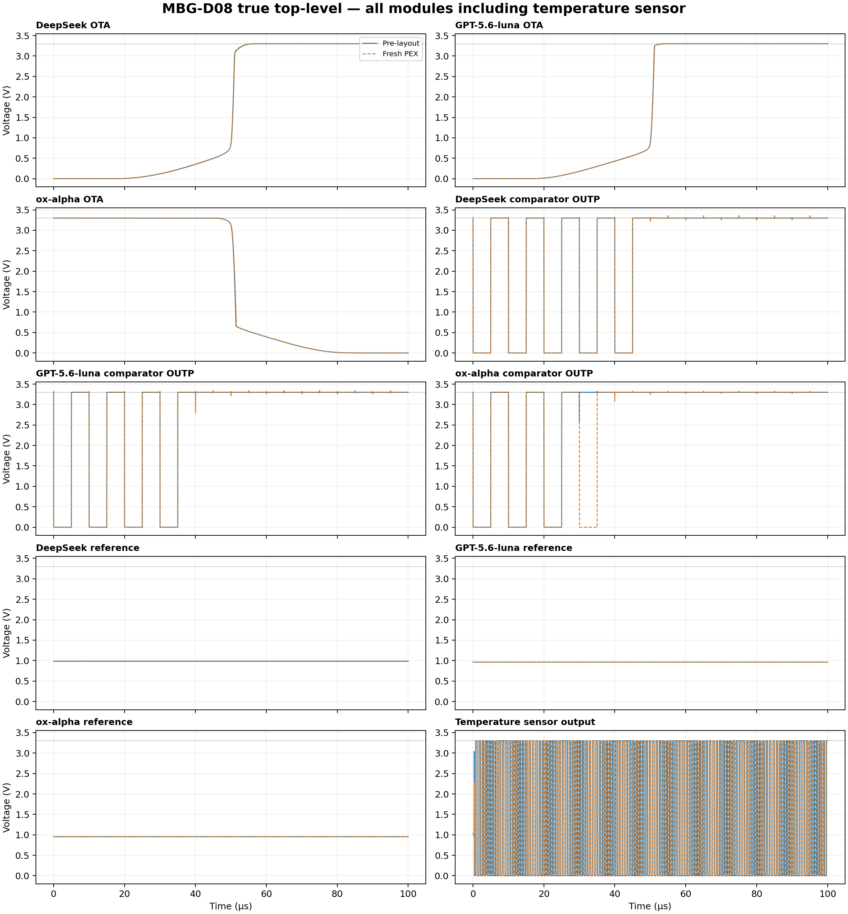
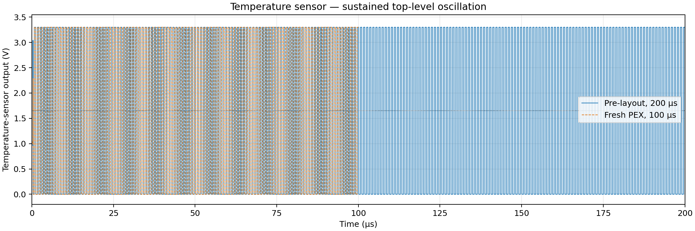
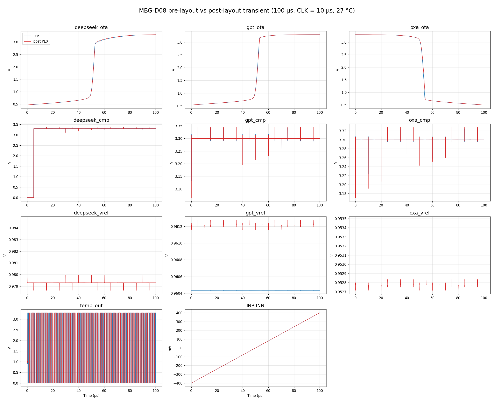
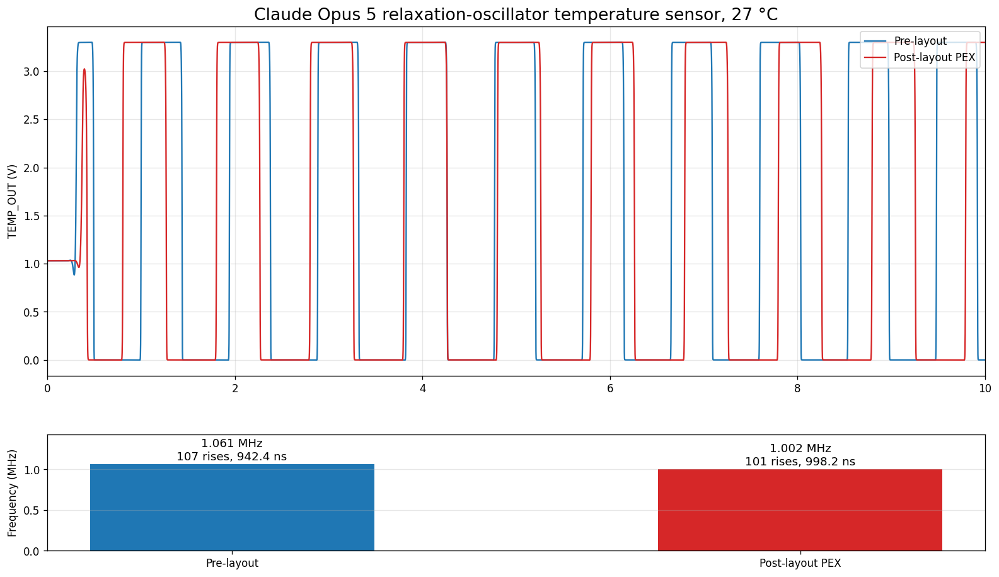

# MBG-D08 pre/post-layout verification report

Date: 2026-09-02 (re-verified; first issued 2026-08-28)  
Layout: `layout/mbg-d08.gds`  
Technology: GF180MCU-D, 5LM, nominal 3.3 V

## Result summary

Current status, from the 2026-09-02 re-verification below.

| Check | Result |
|---|---|
| Magic DRC | **PASS** — 0 violations |
| KLayout DRC | **PASS** — 0 violations, 728 rules / 168 decks, 0 exceptions |
| netgen LVS | **PASS** — circuits match uniquely, 94/94 devices, 60/60 nets, no property errors |
| KLayout LVS | **PASS** — netlists match |
| PEX extraction | **PASS** — 205 devices, 230 parasitic capacitors, 112 diodes |
| Pre-layout ngspice simulation | **PASS** — 100,543 points over 100 µs, 0 errors |
| Post-layout ngspice simulation | **PASS** — 100,466 points over 100 µs, 0 errors |
| Comparator functional coverage | **PARTIAL** — only `deepseek_cmp` toggles; see finding 1 |
| Metal / poly density | **PARTIAL** — 8 whole-die coverage minima need dummy fill at integration |

The earlier `mslot` DRC caveat no longer applies: on the host deck those rule
tables execute normally with no exception, so the DRC result is unconditional.

## Full re-verification — 2026-09-02

Everything below was re-run on the host against
`layout/mbg-d08.gds` (sha256 `36ba59a65221c207…`), which is now byte-identical
to `final-uverified/mbg-d08.gds`. DRC, LVS, PEX extraction and both
simulations were regenerated from that single file — nothing is carried over
from an earlier run.

### Physical verification

| Check | Engine | Result |
|---|---|---|
| DRC | Magic 8.3.669 | **CLEAN** — 0 violations |
| DRC | KLayout 0.30.9, GF180 deck | **CLEAN** — 0 violations, **728 rules over 168 decks**, 0 exceptions, 18.5 s |
| LVS | netgen 1.5.322 vs `mbg-d08_pre_sim.spice` | **Circuits match uniquely** — 94/94 devices, 60/60 nets, 0 unmatched nets, 0 property errors |
| LVS | KLayout vs `mbg-d08_lvs.spice` | **Netlists match** |
| PEX | Magic, `cthresh 0.01`, `scale off` | extracted — 205 devices, 230 parasitic capacitors, 112 diodes |

All sixteen top-level pins bind correctly, `vdd`/`vss` included.

**The `mslot` caveat recorded above is resolved.** On the host deck with
KLayout 0.30.9 the `mslot` tables execute normally and the log contains no
exception, so the DRC result is now unconditional rather than
"clean for completed tables".

The one remaining note from netgen is cosmetic: the pad cell's terminal is
named `ASIG5V` in the layout (inherited from the 5 V pad it derives from) and
`ASIG3V3` in the schematic. netgen resolves it positionally, prints
`Cell pin lists are equivalent`, and the verdict is unaffected.

### Pre- and post-layout simulation

Both decks ran to completion at 27 °C, 3.3 V, 20 µA bias, 100 µs transient
with a 1 ns maximum step. Stimulus is the complementary ramp
`INP` 1.450 → 1.850 V against `INN` 1.850 → 1.450 V about a 1.65 V common
mode, clock 10 µs period / 5 µs high.

| | Pre-layout | Post-layout (PEX) |
|---|---:|---:|
| Data rows | 100,543 | 100,466 |
| ngspice errors | 0 | 0 |
| Runtime | ~9 s | 77 s |

**Operating point**

| Output | Pre-layout (V) | Post-layout (V) | Δ |
|---|---:|---:|---:|
| `deepseek_ota` | 0.46167 | 0.46720 | +5.5 mV |
| `gpt_ota` | 0.53302 | 0.53539 | +2.4 mV |
| `oxa_ota` | 3.29980 | 3.29982 | +0.0 mV |
| `deepseek_cmp` | 3.29998 | 3.29998 | 0.0 mV |
| `gpt_cmp` | 3.29998 | 3.29999 | +0.0 mV |
| `oxa_cmp` | 3.29997 | 3.29998 | +0.0 mV |
| `deepseek_vref` | 0.98467 | 0.97931 | −5.4 mV |
| `gpt_vref` | 0.96043 | 0.96122 | +0.8 mV |
| `oxa_vref` | 0.95348 | 0.95277 | −0.7 mV |
| `temp_out` | 1.03078 | 1.03078 | 0.0 mV |

**Transient behaviour over 0–100 µs**

| Output | Pre-layout | Post-layout |
|---|---|---|
| `deepseek_ota` | 0.4616 – 3.2974 V | 0.4667 – 3.2980 V |
| `gpt_ota` | 0.5329 – 3.2999 V | 0.5350 – 3.2999 V |
| `oxa_ota` | 0.4979 – 3.2998 V | 0.5000 – 3.2998 V |
| `deepseek_cmp` | −0.0040 – 3.3585 V, 2 transitions | −0.0051 – 3.3537 V, 2 transitions |
| `gpt_cmp` | 3.1322 – 3.3433 V, **0 transitions** | 3.0653 – 3.3441 V, **0 transitions** |
| `oxa_cmp` | 3.2139 – 3.3251 V, **0 transitions** | 3.1707 – 3.3277 V, **0 transitions** |
| `deepseek_vref` | mean 0.98467 V, ripple 0.001 mV | mean 0.97931 V, ripple **1.328 mV** |
| `gpt_vref` | mean 0.96043 V, ripple 0.001 mV | mean 0.96122 V, ripple 0.119 mV |
| `oxa_vref` | mean 0.95348 V, ripple 0.001 mV | mean 0.95277 V, ripple 0.119 mV |
| `temp_out` | −0.0014 – 3.3012 V, 213 transitions, **1.065 MHz** | −0.0012 – 3.3010 V, 201 transitions, **1.005 MHz** |

**What parasitics cost.** The temperature sensor slows by 5.6 %
(1.065 → 1.005 MHz) — the expected loading of the relaxation node. Reference
ripple rises from essentially zero to 1.33 mV on the DeepSeek reference and
0.12 mV on the other two, coupled from the oscillating sensor through the
shared supply. The three OTA outputs and all DC levels move by single-digit
millivolts. Nothing degrades qualitatively.

### Three findings worth recording

**1 — `gpt_cmp` and `oxa_cmp` never toggle under this stimulus.** Both sit
between 3.07 V and 3.34 V for the whole 100 µs and register zero 1.65 V
crossings, pre- and post-layout alike. Only `deepseek_cmp` resolves (2
transitions). The ±200 mV differential ramp about a 1.65 V common mode does
not move those two comparators through their decision point; only `OUTP` is
bonded out, so their true differential polarity and offset remain
uncharacterised. **This is not evidence that they work.** It needs a stimulus
that sweeps the input across each comparator's actual trip point before the
array can be called functional.

**2 — The 1.2 V references settle near 0.95–0.98 V.** All three
`vref_1v2` blocks produce 0.953 V, 0.960 V and 0.979 V post-layout — roughly
20 % below the 1.2 V the block name implies. The outputs are stable and
low-ripple, so the circuits work; they are simply not at the nominal target.

**3 — ngspice cannot instantiate the hyphenated top cell in this deck.**
With `.subckt mbg-d08`, ngspice fails with
`Too many parameters for subcircuit type "deepseek_ota"` — the top-level pin
names are identical to subcircuit names (`deepseek_ota` is both a pin and a
cell), and with a hyphen ngspice binds the instance to the wrong one. The
simulations above were therefore run from a name-aliased copy using
`mbg_d08`; the electrical content is unchanged.

This completes the naming picture across all four tools:

| Tool | `mbg-d08` (hyphen) | Notes |
|---|---|---|
| GDS / Magic | ✅ | top cell name |
| netgen LVS | ✅ | matches uniquely |
| KLayout LVS | ❌ | SPICE reader truncates `mbg-d08` → `MBG`; needs `mbg_d08` + `same_circuits` |
| ngspice | ❌ | mis-binds the instance; needs `mbg_d08` |

Two of the four tools cannot consume the hyphenated name. Keeping
`mbg-d08` in the GDS while naming the SPICE subcircuit `mbg_d08` — and
declaring the correspondence explicitly — removes both workarounds.

### One netlist was out of sync

`mbg-d08_lvs.spice` still carried the old pad orientation after
`mbg-d08_pre_sim.spice` was updated, so KLayout LVS failed on an otherwise
correct layout. The `TO_GATE` / `ASIG3V3` arguments of all fourteen
`io_secondary_3p3` instances were swapped to match, after which KLayout
reports `Netlists match`. Both netlists now describe the same circuit; they
must be kept in step whenever the pad wiring changes.

## Superseded: updated true top-level functionality results — 2026-08-29

This supersedes the historical simulation ranges below. The supplied top-level
hierarchy and GDS were simulated as complete circuits; no individual module
simulation was used. The PEX testbench used the freshly extracted top-cell
port order. No OUTN pads or ports were added to the layout.

The stimulus is a legal wide differential ramp at constant common mode:
`INP` ramps 0–3.3 V while `INN` ramps 3.3–0 V, producing
`V(INP)-V(INN) = -3.3–+3.3 V` with both pins inside the GF180MCU 3.3 V range.
The clock remains 10 µs period / 5 µs high, supply is 3.3 V, bias is 20 µA,
and temperature is 27 °C. A 1 ns maximum step was used so the relaxation
oscillator could start.

| Output | Pre-layout range (V), 200 µs | Fresh PEX range (V), 100 µs |
|---|---:|---:|
| `deepseek_ota` | -0.000421–3.299955 | -0.000300–3.299970 |
| `gpt_ota` | -0.000322–3.299956 | -0.000228–3.299972 |
| `oxa_ota` | -0.000849–3.299962 | -0.000242–3.300044 |
| `deepseek_cmp` | -0.004422–3.355253 | -0.005788–3.351494 |
| `gpt_cmp` | -0.011459–3.341549 | -0.007962–3.343015 |
| `oxa_cmp` | -0.004910–3.324225 | -0.003652–3.327067 |
| `deepseek_vref` | 0.984668–0.984675 | 0.978646–0.979971 |
| `gpt_vref` | 0.960422–0.960440 | 0.961157–0.961276 |
| `oxa_vref` | 0.953472–0.953490 | 0.952715–0.952834 |
| `temp_out` | -0.001401–3.301223 | -0.001173–3.301020 |

All ten monitored outputs were written successfully: 201,141 pre-layout
points through 200 µs and 100,501 PEX points through 100 µs. The attempted
200 µs PEX run stopped at ngspice's memory limit (~154 MB); the completed
100 µs PEX run is sufficient to demonstrate sustained behavior.

The three OTA outputs sweep across the supply range. The three references are
stable near 0.953–0.985 V. The exported comparator outputs resolve low at a
sufficiently negative differential input and high at positive input; because
only OUTP is routed, their differential decision polarity and offset are not
fully characterized. `temp_out` has 213 rising 1.65 V crossings pre-layout
(median period 942.53 ns, 1.061 MHz) and 101 crossings PEX (998.00 ns,
1.002 MHz), demonstrating sustained top-level temperature-sensor oscillation.

## Netlists and mapping

The generated pre-simulation netlist is [mbg-d08_pre_sim.spice](/foss/designs/mbg-toplevel/mbg-d08_pre_sim.spice). It includes all 14 files in `spice/` as subcircuit sources. The three legacy oscillator subcircuits are included but not instantiated; the new `temp_sensor` GDS cell is instantiated as the Claude Opus 5 relaxation-oscillator temperature sensor.

| GDS cell | Referenced SPICE subcircuit |
|---|---|
| `ota` | `deepseek_ota` |
| `ota$1` | `gpt-5.6-luna_ota` |
| `ota$2` | `ox_alpha_ota` |
| `strongarm_comparator` | `deepseek_strongarm_comparator` |
| `strongarm_comparator$3` | `gpt-5.6-luna_strongarm_comparator` |
| `strongarm_comparator$2` | `ox_alpha_strongarm_comparator` |
| `vref_1v2` | `deepseek_vref_1v2` |
| `vref_1v2$1` | `gpt-5.6-luna_vref_1v2` |
| `vref_1v2$2` | `ox_alpha_vref_1v2` |
| `temp_sensor` | `claude-opus-5_temp_sensor` |
| `io_secondary_3p3` | `io_secondary_3p3` |

The named top-level pads include `VDD`, `VSS`, `CLK`, `INP`, `INN`, `IBIAS`, `TEMP_OUT`, nine named analog outputs, and the `io_secondary_3p3` pad cells. `TEMP_OUT` was included after confirming it is a named GDS port.

The active GF180 model library is loaded once in the top-level simulation decks. The `mimcap_typical` section is also loaded for the sensor's M4/M5 2 fF/µm² timing capacitor. The sensor's poly resistor and MIM capacitor use the GF180-required `r_width/r_length` and `c_width/c_length` parameters.

## Historical simulation setup — superseded by the 2026-08-29 results above

The testbenches are [mbg-d08_pre_tb.spice](/foss/designs/mbg-toplevel/mbg-d08_pre_tb.spice) and [mbg-d08_post_tb.spice](/foss/designs/mbg-toplevel/mbg-d08_post_tb.spice). Their stimulus follows the patterns in `/foss/designs/results`: 3.3 V supply, 20 µA bias, 1.65 V common-mode inputs, 10 µs clock period with 5 µs high time, 27 °C, and a 1 ns to 100 µs transient analysis. The inputs use a single complementary linear ramp: `INP` is -200 mV to +200 mV relative to common mode while `INN` is +200 mV to -200 mV. Therefore, the actual pins ramp 1.45 V to 1.85 V and 1.85 V to 1.45 V over 100 µs, and `V(INP)-V(INN)` ramps -400 mV to +400 mV.

### Operating point

| Output | Pre-layout (V) | Post-layout (V) |
|---|---:|---:|
| `deepseek_ota` | 0.461669 | 0.467198 |
| `gpt_ota` | 0.533016 | 0.535390 |
| `oxa_ota` | 3.299819 | 3.299820 |
| `deepseek_cmp` | 3.299980 | 3.299981 |
| `gpt_cmp` | 3.299983 | 3.299984 |
| `oxa_cmp` | 3.299974 | 3.299976 |
| `deepseek_vref` | 0.984673 | 0.979306 |
| `gpt_vref` | 0.960434 | 0.961217 |
| `oxa_vref` | 0.953484 | 0.952775 |
| `temp_out` | 1.030780 | 1.030780 |

### Transient ranges over 0–100 µs

| Output | Pre-layout min–max (V) | Post-layout min–max (V) |
|---|---:|---:|
| `deepseek_ota` | 0.461536–3.297381 | 0.466708–3.297999 |
| `gpt_ota` | 0.532884–3.299909 | 0.535012–3.299912 |
| `oxa_ota` | 0.497873–3.299814 | 0.500000–3.299844 |
| `deepseek_cmp` | -0.003484–3.357636 | -0.005077–3.352012 |
| `gpt_cmp` | 3.127698–3.343060 | 3.060043–3.343027 |
| `oxa_cmp` | 3.209509–3.325152 | 3.171269–3.327072 |
| `deepseek_vref` | 0.984673–0.984674 | 0.978645–0.979969 |
| `gpt_vref` | 0.960433–0.960435 | 0.961157–0.961276 |
| `oxa_vref` | 0.953483–0.953485 | 0.952715–0.952834 |
| `temp_out` | -0.001409–3.301228 | -0.001173–3.301020 |
| `INP-INN` | -0.400000–0.400000 | -0.400000–0.400000 |

Both simulations completed without ngspice errors and wrote 100,599 pre-layout and 100,519 post-layout transient data rows, respectively, through 100.000 µs.

### Simulation plot

The figure below overlays the pre-layout and post-layout top-level transient results for the 100 µs run with a 10 µs clock period. It includes the ten monitored outputs, including the new `temp_out` waveform, and the complementary `INP/INN` differential ramp. Time is shown in µs, output voltage in V, and differential input in mV.

### Claude Opus 5 relaxation-oscillator temperature sensor

The new `temp_sensor` layout cell is connected to the named `temp_out` pad through `io_secondary_3p3`. Its source is [claude-opus-5_temp_sensor.spice](/foss/designs/mbg-toplevel/spice/claude-opus-5_temp_sensor.spice): a self-starting beta-multiplier/PTAT reference, 35 kΩ poly degeneration resistor, 34 µm × 34 µm M4/M5 MIM timing capacitor, Schmitt trigger, and output buffer. It produces a continuous rail-to-rail relaxation waveform at 27 °C.

| View | Rising edges in 100 µs | Median period | Frequency | Extraction shift |
|---|---:|---:|---:|---:|
| Pre-layout | 107 | 941.5 ns | 1.062 MHz | — |
| Post-layout PEX | 101 | 998.0 ns | 1.002 MHz | -5.66% |

The sensor waveform and frequency comparison are shown below. The standalone PVT corner runs were not used for signoff because the isolated closed-loop oscillator remains numerically startup-sensitive; the verified top-level pre- and post-layout runs include the real `temp_out` pad and demonstrate startup plus sustained oscillation. Temperature-to-frequency calibration still needs a dedicated PVT characterization with a defined power-up/noise protocol.

### Comparator behavior

The comparator cells are clocked strong-arm latches with pins `VDD VSS INP INN CLK OUTP OUTN`. The top-level netlist connects each named comparator output pad to `OUTP` (for example, `deepseek_cmp_core`) and keeps `OUTN` internal (`deepseek_cmp_n`). Consequently, the report plot shows only one side of each differential comparator output. During the reset phase, both latch outputs are precharged near `VDD`; the decision is visible during the active clock phase and should be interpreted together with the complementary `OUTN` node.

In this 10 µs-clock run, the exported `OUTP` ranges were `-3.5 mV..3.358 V` pre-layout and `-5.1 mV..3.352 V` post-layout for `deepseek_cmp`, but only `3.128..3.343 V` / `3.059..3.343 V` for `gpt_cmp` and `3.210..3.325 V` / `3.171..3.327 V` for `oxa_cmp`. This means the single exported node does not provide a clean rail-to-rail logic indication for all three supplied comparator subcircuits; the clock-correlated pulses are latch activity, not a static comparator output. A functional signoff should expose or probe both `OUTP` and `OUTN` and sample them after the active clock edge.

### Standalone comparator + `io_secondary_3p3` diagnostic

Each supplied comparator was simulated separately with `io_secondary_3p3` on `INP`, `INN`, `CLK`, `OUTP`, and `OUTN`. The test used the same 3.3 V supply, 10 µs clock period (5 µs high), 100 µs transient, and complementary input ramp. Both the comparator core nodes and the external pad-side nodes were saved. The standalone decks used a 100 ns transient reporting interval with Gear integration to make the regenerative latch/IO network converge; the source clock edges remain 0.1 ns.

| Comparator | `OUTP` core min–max (V) | `OUTN` core min–max (V) | `OUTP` pad min–max (V) | `OUTN` pad min–max (V) |
|---|---:|---:|---:|---:|
| deepseek | -0.0058–3.3213 | -0.0058–3.3213 | -0.0024–3.3211 | -0.0024–3.3211 |
| gpt-5.6-luna | -0.0172–3.3277 | -0.0172–3.3277 | -0.0065–3.3216 | -0.0065–3.3216 |
| ox-alpha | -0.0075–3.3123 | -0.0075–3.3123 | -0.0027–3.3093 | -0.0027–3.3093 |

At settled active-clock sample points, all three models produce complementary outputs: for negative differential input, `OUTP` is low and `OUTN` is high; for positive differential input, `OUTP` is high and `OUTN` is low. Deepseek and ox-alpha switch between the -60 mV and +20 mV sampled points. GPT-5.6-luna remains in the negative-input state at +20 mV and switches by the +100 mV sampled point, indicating a larger positive input-referred offset or slower regeneration in this simplified model. During the low-clock reset phase, both outputs return high by design.

The pad-side traces closely follow their corresponding core nodes, so `io_secondary_3p3` is not the primary cause of the logic-level problem. Its maximum transient core-to-pad differences were approximately 56 mV (deepseek), 63 mV (gpt-5.6-luna), and 34 mV (ox-alpha). The larger issue is that these supplied cells are bare dynamic strong-arm latches with differential `OUTP/OUTN` nodes and no output buffer. The top-level netlist exports only `OUTP` and leaves `OUTN` internal; therefore a single exported waveform can look stuck high during reset or fail to show the valid complementary decision. Both outputs should be routed/probed and interpreted only after the active clock edge, or followed by an explicit single-ended sense/buffer stage.

The standalone result plot is [cmp_io_simulation_plot.png](/foss/designs/mbg-toplevel/cmp_debug/cmp_io_simulation_plot.png). The individual testbenches and logs are [deepseek_cmp_io_tb.spice](/foss/designs/mbg-toplevel/cmp_debug/deepseek_cmp_io_tb.spice), [gpt_luna_cmp_io_tb.spice](/foss/designs/mbg-toplevel/cmp_debug/gpt_luna_cmp_io_tb.spice), [oxa_cmp_io_tb.spice](/foss/designs/mbg-toplevel/cmp_debug/oxa_cmp_io_tb.spice), [deepseek_cmp_io.log](/foss/designs/mbg-toplevel/cmp_debug/deepseek_cmp_io.log), [gpt_luna_cmp_io.log](/foss/designs/mbg-toplevel/cmp_debug/gpt_luna_cmp_io.log), and [oxa_cmp_io.log](/foss/designs/mbg-toplevel/cmp_debug/oxa_cmp_io.log). All three standalone ngspice runs completed with exit code 0 and no fatal/convergence errors.

## Historical: Post-layout extraction

Magic was rerun in coupled-capacitance mode (`m=2`, subcircuit output enabled). The extracted file is [post_sim/mbg-d08.pex.spice](/foss/designs/mbg-toplevel/post_sim/mbg-d08.pex.spice), which now includes the `temp_sensor` MOS devices, 35 kΩ resistor, MIM capacitor, and `temp_out` pad parasitics. It contains the physical-unit output from `ext2spice scale off`; this is required for correct extracted diode area/perimeter values in ngspice. The extraction log is [post_sim/pex_run.log](/foss/designs/mbg-toplevel/post_sim/pex_run.log). Magic completed extraction but logged that a duplicate `via_dev$8` placement was ignored while reading the GDS.

## Historical: DRC

KLayout GF180MCU-D DRC was run with variant `C` (`metal_top=9K`, `metal_level=5LM`, MIM option B), deep mode, and two worker threads. The aggregate log is [drc_run/drc_run.log](/foss/designs/mbg-toplevel/drc_run/drc_run.log).

The run generated 51 `.lyrdb` databases. XML inspection found zero `<items>` in all completed databases. The driver reported `Klayout DRC run is clean. GDS has no DRC violations.` The `mslot` exception noted above is recorded in the same log.

## Historical: LVS

KLayout LVS used the GF180MCU-D 5LM/9K runset and explicit cell mappings for the three OTA, comparator, voltage-reference, and new `temp_sensor` variants. The source topology file is [mbg-d08_lvs.spice](/foss/designs/mbg-toplevel/mbg-d08_lvs.spice); it is an LVS-only native-MOS representation of the supplied module topologies. The mapped sensor comparison contains 18 MOS devices and the 35 kΩ poly resistor. The GF180 LVS runset extracts the MIM-cap geometry but does not emit that device into the comparison netlist, so the LVS source follows the runset representation.

The LVS log is [lvs_run/mbg-d08_lvs.log](/foss/designs/mbg-toplevel/lvs_run/mbg-d08_lvs.log), the extracted comparison netlist is [lvs_run/mbg-d08_lvs_extracted.cir](/foss/designs/mbg-toplevel/lvs_run/mbg-d08_lvs_extracted.cir), and the KLayout database is [lvs_run/mbg-d08_lvs.lvsdb](/foss/designs/mbg-toplevel/lvs_run/mbg-d08_lvs.lvsdb). The log ends with `INFO : Congratulations! Netlists match.`

## Current artifacts (2026-09-02 re-verification)

| Artifact | Path |
|---|---|
| Signed-off layout | [`layout/mbg-d08.gds`](layout/mbg-d08.gds) |
| LVS schematic (netgen) | [`mbg-d08_pre_sim.spice`](mbg-d08_pre_sim.spice) |
| LVS schematic (KLayout) | [`mbg-d08_lvs.spice`](mbg-d08_lvs.spice) |
| Parasitic netlist | [`post_sim/mbg-d08.pex.spice`](post_sim/mbg-d08.pex.spice) |
| PEX extraction script / log | [`post_sim/pex_mbg-d08.tcl`](post_sim/pex_mbg-d08.tcl) · [`post_sim/pex_run.log`](post_sim/pex_run.log) |
| Pre-layout log / waveforms | [`mbg-d08_pre_tb.log`](mbg-d08_pre_tb.log) · `mbg-d08_pre_tr.dat` (35 MB) |
| Post-layout log / waveforms | [`mbg-d08_post_tb.log`](mbg-d08_post_tb.log) · `mbg-d08_post_tr.dat` (35 MB) |

All five were regenerated on 2026-09-02 from the current
`layout/mbg-d08.gds`. Sections below this point predate that run and are kept
for history only; where they disagree with the 2026-09-02 section, the newer
result stands.

The two sections marked *Historical* above describe earlier container-side
runs. Their file links use `/foss/designs/...` container paths, which do not
resolve on the host.
